# 考试报名系统

## 1 项目分析

### 1.1 背景分析

考试报名系统是一个学校不可缺少的部分，它对于学校的管理者和学生来说都至关重要，所以一个良好的考试报名系统应该能够为用户提供充足的信息和功能。考试报名系统对于学校加强考试管理有极其重要的作用。随着学生数量和考试数量的日益庞大，如何管理如此庞大的数据显得极为复杂，传统的手工管理工作量大且容易出错。

随着计算机科学技术的不断成熟，使用计算机对考试报名系统进行管理，具有手工管理所无法比拟的优势。这些优点能够极大地提高学校和学生的效率，也是学校走向信息化、科学化、国际化的重要条件。因此，开发一套考试报名系统具有十分重要的意义。

### 1.2 功能分析

作为一个最简易的考试报名系统，首先应该有的功能就是输入同学们的考试报名情况并且可以予以显示。其次，考试报名系统还应该具有插入、删除、修改功能，以保证同学可以随时更改自己的考试报名情况。最后，考试报名系统软件还应该确保软件可以正常关闭。

综上所述，一个考试报名系统至少应该具有输入、输出、插入、删除、修改、退出的功能。


## 2 设计

### 2.1 数据结构设计

如上功能分析所述，该系统要求大量的增加、删除、修改操作，而链表进行增加、删除等操作十分简便，因此考虑使用链表数据结构。同时，为了实现简易，在第一个结点之前附加一个头结点，这样就使得增加或者删除头结点与处理其他结点方法相同，使得程序简洁。

### 2.2 类结构设计

经典的链表一般包括两个抽象数据类型（ADT）——链表结点类（LNode）与链表类（LinkList），而两个类之间的耦合关系可以采用嵌套、继承等多种关系。

### 2.3 成员与操作设计

#### 2.3.1 链表节点类

|     变量名     |     说明     |
| :------------: | :----------: |
|   string num   |     考号     |
|   string sex   |     性别     |
|  string name   |     姓名     |
|   string age   |     年龄     |
| string subject |   报考类别   |
| Student * next | 节点的指针域 |

Student类的构造函数，初始化结点数据：

```c++
Student::Student() {
  num = '0';
  sex = '\0';
  name = '\0';
  age = '0';
  subject = '\0';
  next = NULL;
}
```

#### 2.3.2 链表操作类

|       变量/函数名       |   说明   |
| :---------------------: | :------: |
|      Student *head      |  头结点  |
| void Create(Operate &n) | 创建系统 |
|  void Find(Operate &n)  |   查找   |
| void Insert(Operate &n) |   插入   |
| void Change(Operate &n) |   修改   |
| void Delete(Operate &n) |   删除   |
| void Print(Operate &n)  |   输出   |
| int Length(Operate &n)  |   长度   |
|        Operate()        | 构造函数 |


## 3 实现

### 3.1 插入功能的实现

#### 3.1.1 插入功能流程图

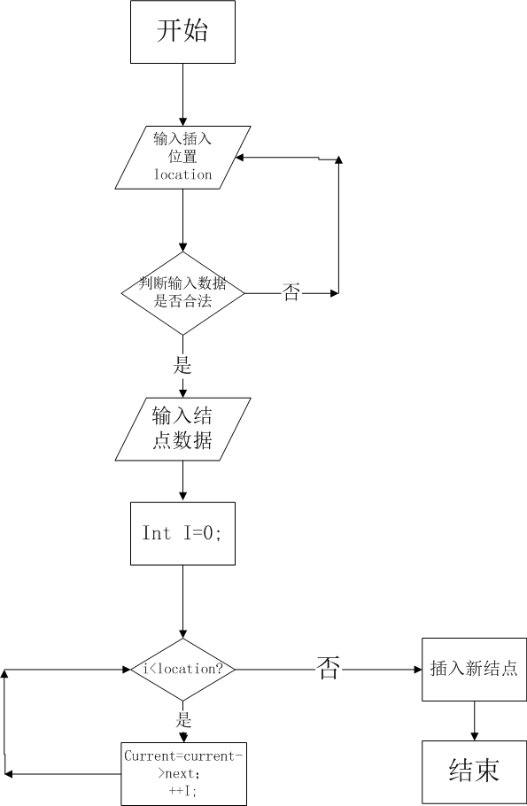 

 

 

#### 3.1.2 插入功能核心代码

```c++
	if(i == 1) {
		p->next = n.head;
		n.head = p;
} else {
		int a = 1;
		while (a != i - 1) {
		s = s->next;
		a++;
	}
	p->next = s->next;
	s->next = p;
}
```

#### 3.1.3 插入功能截屏示例

 

### 3.2 删除功能的实现

#### 3.2.1 删除功能流程图

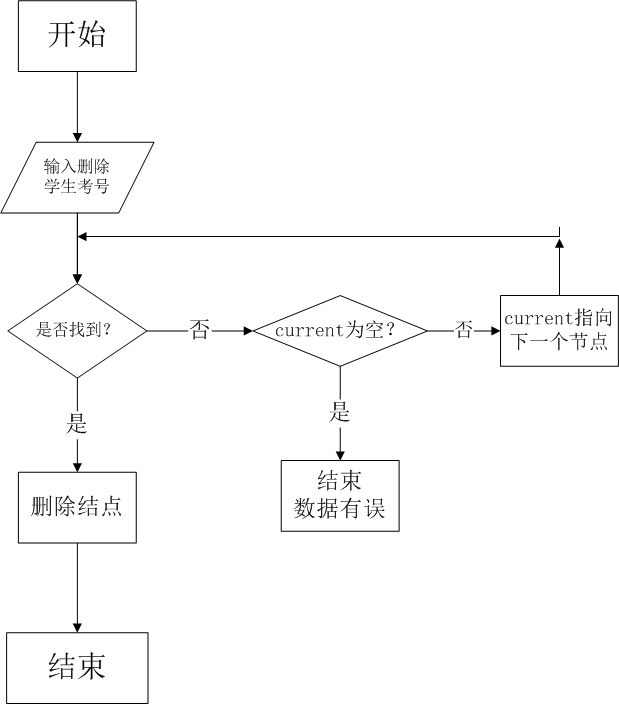 

#### 3.2.2 删除功能核心代码

```c++
    if(n.head->num == num) {
    	s = n.head;
      n.head = n.head -> next;
      cout << "你删除的考生信息是:" << s->num << '\t' << s->name <<'\t' << s->sex << '\t' << s->age <<'\t' << s->subject << endl;
      delete s;
      return;
		}
    Student *p = n.head;
    while(p->next != NULL) {
        if (p->next->num == num) {
            auto q = p-> next;
            p->next = p->next->next;
            cout << "你删除的考生信息是:" << q->num << '\t' << q->name <<'\t' << q->sex << '\t' << q->age <<'\t' << q->subject << endl;
            delete q;
            return;
        }
        p = p->next;
    }
```

#### 3.2.3删除功能截屏示例

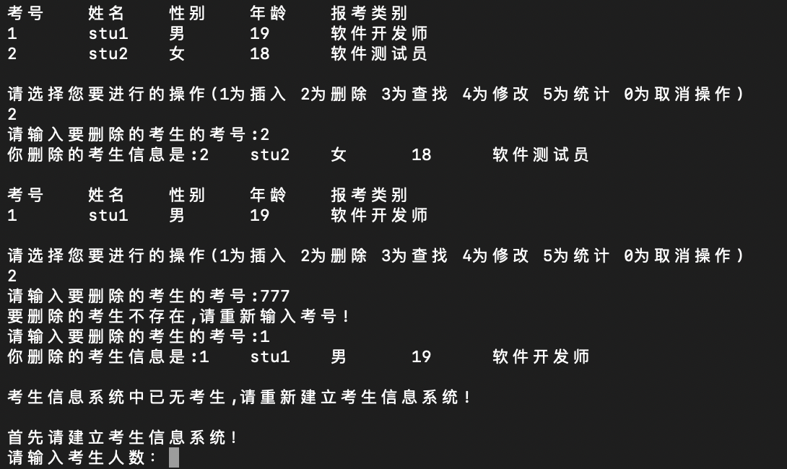 

### 3.3 查找功能的实现

#### 3.3.1 查找功能流程图

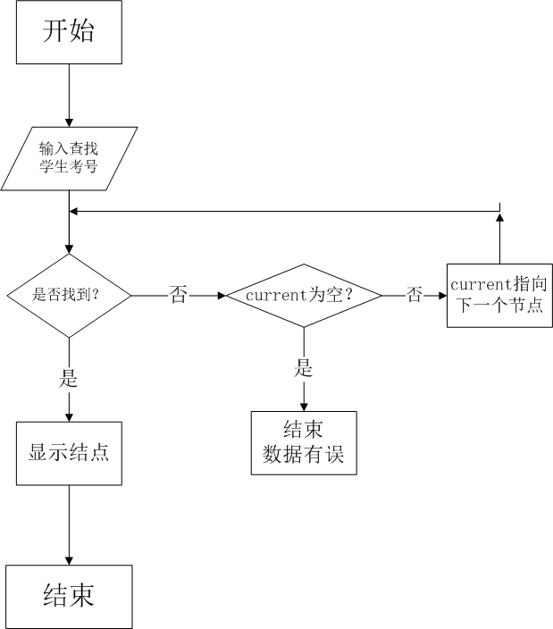 

#### 3.3.2 查找功能核心代码

```c++
	if(p->num == num){
     cout << p->num << "\t" 
     << p->name << "\t" 
     << p->sex << "\t" 
     << p->age << "\t" 
     << p->subject << endl;
     break;
  } else {
     p = p->next;
     i++;
}
```

 

#### 3.3.3 查找功能截屏示例 

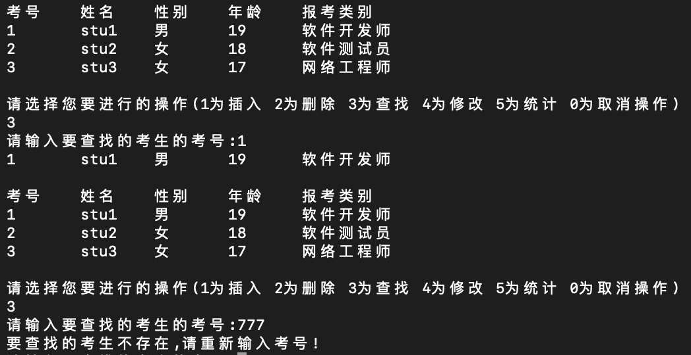

### 3.4 修改功能的实现

#### 3.4.1 修改功能流程图

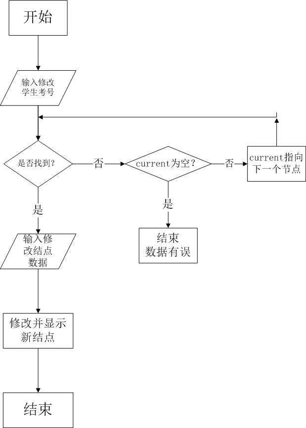 

#### 3.4.2 修改功能核心代码

```c++
if(p->num == num) {
		a:cout << "请依次输入修改后的考生的考号,姓名,性别,年龄以及报考类别!" << endl;
		string num;
		cin >> num;
            
		string name;
		cin >> name;
            
		string sex;
		cin >> sex;
            
		string age;
		cin >> age;
            
		string type;
		cin >> type;
}

		p->num = num;
		p->name = name;
		p->sex = sex;
		p->subject = type;
		p->age = age;

```

 

#### 3.4.3 修改功能截屏示例

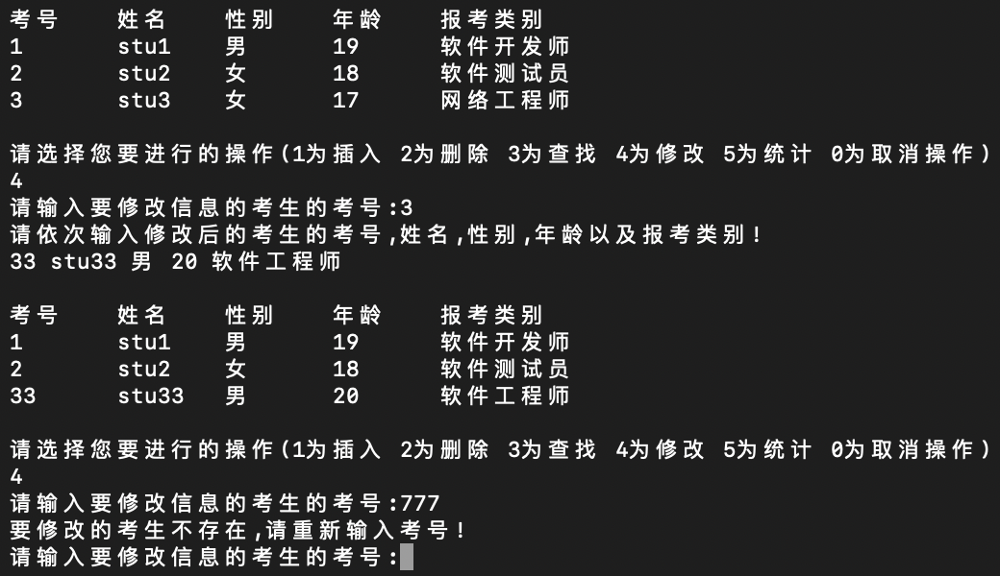 

### 3.5 统计功能的实现

#### 3.5.1 统计功能核心代码

 

#### 3.5.2 统计功能截屏示例

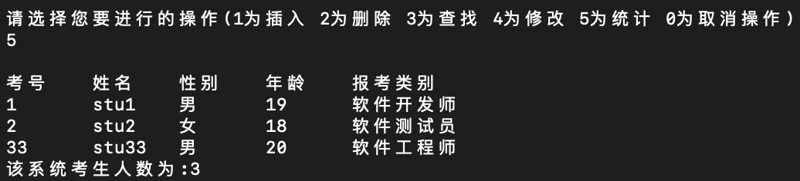

### 3.6 建立系统功能的实现

#### 3.6.1 建立系统流程图

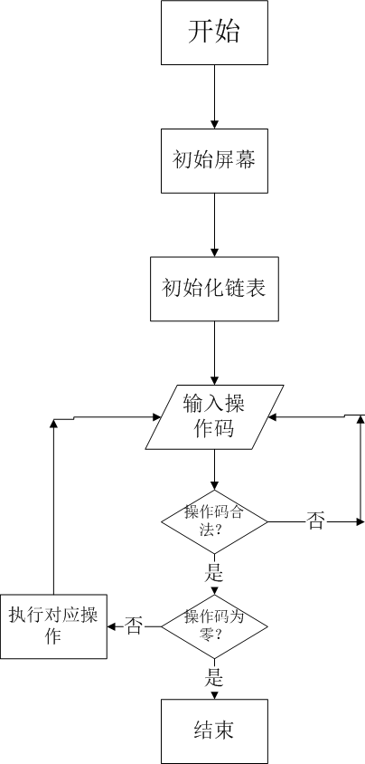 

####  3.6.2 建立系统核心代码

```c++
a:    cout << "首先请建立考生信息系统！" << endl;
    Operate n;
    n.Create(n);
    n.Print(n);
```


#### 3.6.3 建立系统截屏示例


 

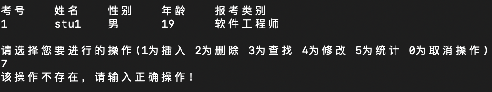

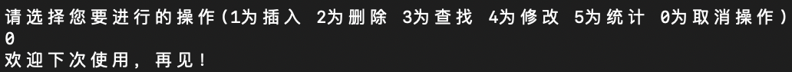 

## 4 测试

### 4.1 功能测试

#### 4.1.1 插入功能测试

**测试用例：** 0 stu0 男 18 网络工程师

**预期结果：**

0 stu0 男 18 网络工程师

1 stu1 男 20 软件开发师

2 stu2 女 19 软件测试员

**测试结果：**

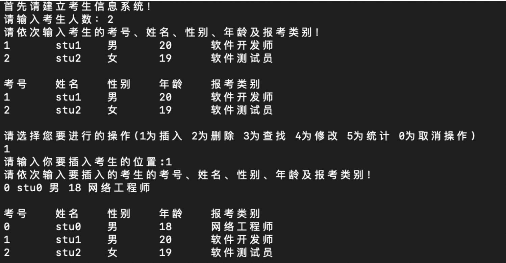 

#### 4.1.2 删除功能测试

**测试用例：**删除考号为2的考生

**预期结果：** 1 stu1 男 19 软件开发师

**测试结果：**

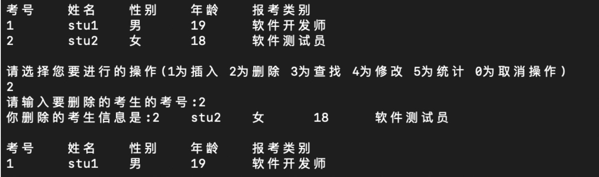 

#### 4.1.3 查找功能测试

**测试用例：**查找考号为1的考生

**预期结果:** 1 stu1 男 19 软件开发师

**测试结果:**

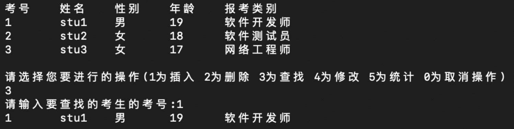 

#### 4.1.4 修改功能测试

**测试用例：**将考号为3的考生信息修改为 33 stu33 男 20 软件工程师

**预期结果：**33 stu33 男 20 软件工程师

**测试结果：**

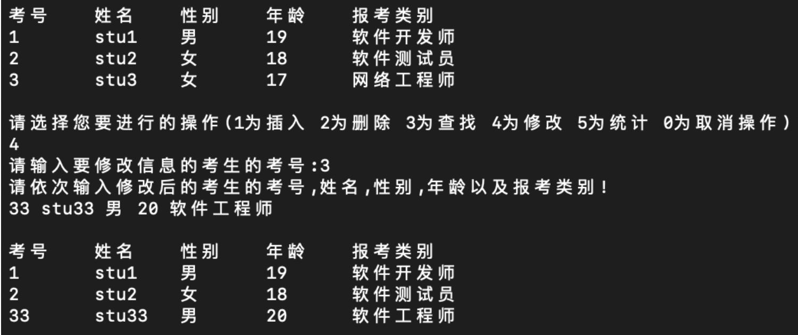 

#### 4.1.5 统计功能测试

**测试用例：**统计当前数据

**测试结果：**


### 4.2．边界测试

#### 4.2.1 初始化无数据输入或输入非法

**测试用例：**初始化无数据输入或输入非法

**预期结果：**给出错误提示，程序运行正常不崩溃

**测试结果：**

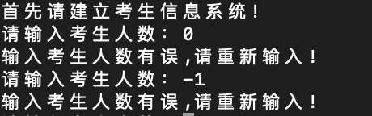 

#### 4.2.2 删除头结点

**测试用例：**删除头结点

**预期结果：**程序运行正常不崩溃

**实验结果：**

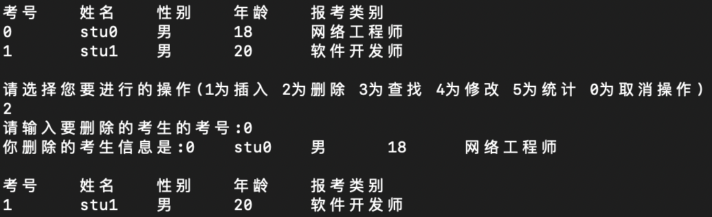 

#### 4.2.3 删除后链表为空

**测试用例：** 删除后链表为空

**预期结果：**给出提示，程序运行正常不崩溃，并重新建立系统

**实验结果：**

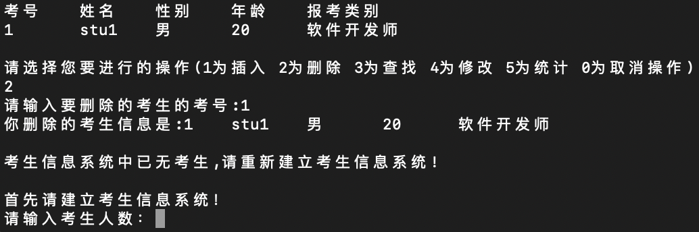

### 4.3出错测试

#### 4.3.1 操作码错误

**测试用例：** 操作码错误

**预期结果：**程序给出提示信息，程序运行正常不崩溃

**实验结果：**

 

#### 4.3.2 考生考号年龄输入错误

**测试用例：**考生考号年龄输入错误

**预期结果：** 程序给出提示信息，程序运行正常不崩溃

**实验结果：**

 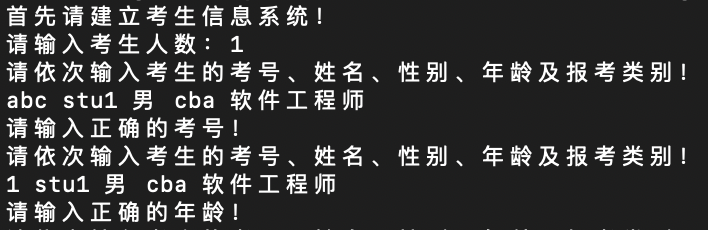

#### 4.3.3 插入位置不存在

**测试用例：**插入位置不存在

**预期结果：** 程序给出提示信息，程序运行正常不崩溃

**实验结果：**

 

#### 4.3.4 删除考号不存在

**测试用例：**删除考号不存在

**预期结果：** 程序给出提示信息，程序运行正常不崩溃

**实验结果：**

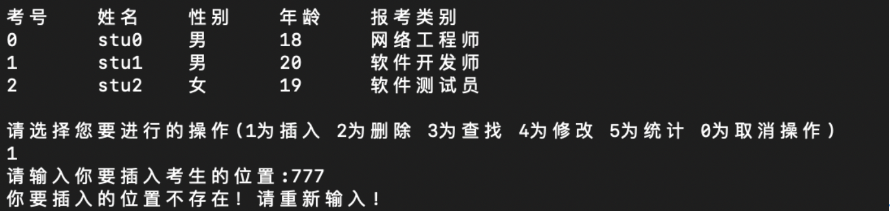 

#### 4.3.5 查找考号不存在

**测试用例：** 查找考号不存在

**预期结果：** 程序给出提示信息，程序运行正常不崩溃

**实验结果：**

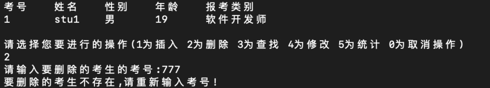 

#### 4.3.6 修改考号不存在

**测试用例：** 修改考号不存在

**预期结果：** 程序给出提示信息，程序运行正常不崩溃

**实验结果：**

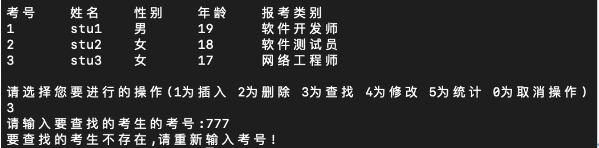 