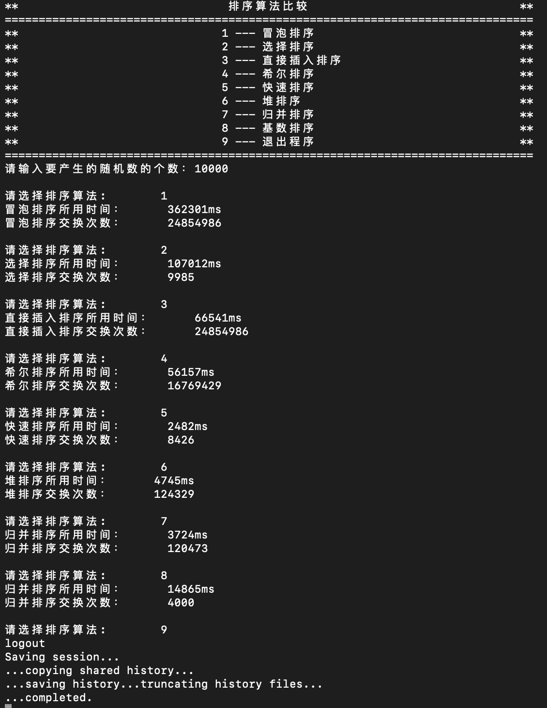
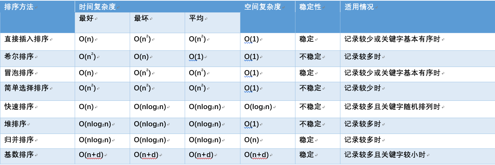

# 8种排序算法的比较案例

## 1 冒泡排序

1. 相邻两个数两两相比，n[i]跟n[j+1]比，如果n[i]>n[j+1]，则将连个数进行交换；

2. j++, 重复以上步骤，第一趟结束后，最大数就会被确定在最后一位，这就是冒泡排序又称大（小）数沉底；

3. i++,重复以上步骤，直到i=n-1结束，排序完成。

```c++
void BubbleSort(int arr[]) {
    int * a = new int[N];
    memcpy(a, arr, N*sizeof(int));
    
    int count = 0;
    int flag = 1;//是否发生交换标志，默认无序即发生了交换
    
    for (int i = 0; (i < N) && flag; i++) {
        flag = 0;
        for (int j = N - 2; j >= i; j--) {
            if (a[j] > a[j + 1]) {
                swap(a[j], a[j + 1]);
                flag = 1;
                count++;
            }
        }
    }
    
    delete[] a;
}
```

1. 不管原始数组是否有序，时间复杂度都是O（n^2^）

因为每一个数都要与其他数比较一次，（n-1）^2^ 次，分解：n^2^+2n-1,  去掉低次幂和常数，剩下n^2^，所以最后的时间复杂度是n^2^。

2. 空间复杂度是O（1）,因为只定义了一个辅助变量，与n的大小无关，所以空间复杂度为O（1）。


## 2 选择排序

1. 第一个跟后面的所有数相比，如果小于（或小于）第一个数的时候，暂存较小数的下标，第一趟结束后，将第一个数，与暂存的那个最小数进行交换，第一个数就是最小（或最大的数）。

2. 下标移到第二位，第二个数跟后面的所有数相比，一趟下来，确定第二小（或第二大）的数。

3. 重复以上步骤，直到指针移到倒数第二位，确定倒数第二小（或倒数第二大）的数，那么最后一位也就确定了，排序完成。

```c++
void SelectionSort(int arr[])
{
    int * a = new int[N];
    memcpy(a, arr, N*sizeof(int));
    int count = 0;
    
    int i = 0, j = 0, min = 0;
    for (i = 0; i < N; i++) {
        min = i;
        for (j = i + 1; j < N; j++) {
            if (a[min] > a[j]) {
                min = j;
            }
        }
        if (i != min) {
            swap(a[min], a[i]);
            count++;
        }
    }
    delete[] a;
}
```

1. 不管原始数组是否有序，时间复杂度都是O（n^2^），

因为没一个数都要与其他数比较一次，（n-1）^2^次，分解：n^2^-2n+1, 去掉低次幂和常数，剩下n^2^,所以最后的时间复杂度是n^2^。

2. 空间复杂度是O（1）,因为只定义了两个辅助变量，与n的大小无关，所以空间复杂度为O（1）。


## 3 直接插入排序

例如从小到大排序：

1.从第二位开始遍历；

2.当前数（第一趟是第二位数）与前面的数依次比较，如果前面的数大于当前数，则将这个数放在当前数的位置上，当前数的下标-1；

3.重复以上步骤，直到当前数不大于前面的某一个数为止，这时，将当前数，放到这个位置；

1-3步就是保证当前数的前面的数都是有序的，内层循环的目的就是将当前数插入到前面的有序序列里。

4.重复以上3步，直到遍历到最后一位数，并将最后一位数插入到合适的位置，插入排序结束。

```c++
void InsertionSort(int arr[])
{
    int * a = new int[N];
    memcpy(a, arr, N*sizeof(int)); 
    int count = 0;
    
    int tmp = 0;
    for (int i = 1; i < N; i++) {
        int k = i;//需要插入的位置
        tmp = a[i];
        for (int j = i - 1; (j >= 0) && (a[j] > tmp); j--) {
            count++;
            a[j + 1] = a[j];
            k = j;
        }
        a[k] = tmp;
    }
    delete[] a;
}
```

1. 时间复杂度：插入算法，就是保证前面的序列是有序的，只需要把当前数插入前面的某一个位置即可。 所以如果数组本来就是有序的，则数组的最好情况下时间复杂度为O（n）。

   如果数组恰好是倒序，比如原始数组是5 4 3 2 1，想要排成从小到大，则每一趟前面的数都要往后移，一共要执行n-1 + n-2 + … + 2 + 1 = n * (n-1) / 2 = 0.5 * n^2^ - 0.5 * n次，去掉低次幂及系数，所以最坏情况下时间复杂度为O（n2）。

  平均时间复杂度(n+n^2^ )/2，所以平均时间复杂度为O（n^2^）

2. 空间复杂度：插入排序算法，只需要两个变量暂存当前数，以及下标，与n的大小无关，所以空间复杂度为：O（1）。


## 4 希尔排序

希尔排序是把记录按下标的一定增量分组，对每组使用直接插入排序算法排序；随着增量逐渐减少，每组包含的关键词越来越多，当增量减至1时，整个文件恰被分成一组，算法便终止。

简单插入排序很循规蹈矩，不管数组分布是怎么样的，依然一步一步的对元素进行比较，移动，插入，比如[5,4,3,2,1,0]这种倒序序列，数组末端的0要回到首位置很是费劲，比较和移动元素均需n-1次。

而希尔排序在数组中采用跳跃式分组的策略，通过某个增量将数组元素划分为若干组，然后分组进行插入排序，随后逐步缩小增量，继续按组进行插入排序操作，直至增量为1。希尔排序通过这种策略使得整个数组在初始阶段达到从宏观上看基本有序，小的基本在前，大的基本在后。然后缩小增量，到增量为1时，其实多数情况下只需微调即可，不会涉及过多的数据移动。

```c++
void ShellSort(int arr[])
{
    int * a = new int[N];
    memcpy(a, arr, N*sizeof(int));
    
    int tmp = 0;
    int gap = N;
    do {
        gap = gap / 3 + 1;
        for (int i = gap; i < N; i += gap) {
            int k = i;//需要插入的位置
            tmp = a[i];
            for (int j = i - gap; (j >= 0) && (a[j] > tmp); j -= gap) {
                a[j + gap] = a[j];
                k = j;
                count++;
            }
            a[k] = tmp;
        }
 
    } while (gap > 1);

    delete[] a;
}
```

1. 时间复杂度：最坏情况下，每两个数都要比较并交换一次，则最坏情况下的时间复杂度为O（n^2^）, 最好情况下，数组是有序的，不需要交换，只需要比较，则最好情况下的时间复杂度为O（n）。

经大量人研究，希尔排序的平均时间复杂度为O（n^1.3^）。（来源各种资料）

2. 空间复杂度：希尔排序，只需要一个变量用于两数交换，与n的大小无关，所以空间复杂度为：O（1）。


## 5 快速排序

快速排序的思想就是，选一个数作为基数（这里我选的是第一个数），大于这个基数的放到右边，小于这个基数的放到左边，等于这个基数的数可以放到左边或右边，我放到了左边。

一趟结束后，将基数放到中间分隔的位置，第二趟将数组从基数的位置分成两半，分割后的两个的数组继续重复以上步骤，选基数，将小数放在基数左边，将大数放到基数的右边，再分割数组直到数组不能再分为止，排序结束。

例如从小到大排序：

1. 第一趟，第一个数为基数temp，设置两个指针left = 0，right = n.length。

　　①从right开始与基数temp比较，如果n[right]>基数temp，则right指针向前移一位，继续与基数temp比较，直到不满足n[right]>基数temp；

　　②将n[right]赋给n[left]；

　　③从left开始与基数temp比较，如果n[left]<=基数temp，则left指针向后移一位，继续与基数temp比较，直到不满足n[left]<=基数temp；

　　④将n[left]赋给n[rigth]；

　　⑤重复①-④步，直到left==right结束，将基数temp赋给n[left]。

2. 第二趟，将数组从中间分隔，每个数组再进行第1步的操作，然后再将分隔后的数组进行分隔再快排；

3. 递归重复分隔快排，直到数组不能再分，也就是只剩下一个元素的时候，结束递归，排序完成。

```c++
void QuickSort_help(int a[],int left,int right) {
    if (left < right) {
        int i = left, j = right, x = a[left];
        while (i < j && a[j] >= x)
            j--;//从右到左找到第一个小于X的数
        if (i < j) {
            a[i++] = a[j];
            Count++;
        }
        while (i < j && a[i] <= x)
            i++;//从左到右找到第一个大于X的数
        if (i < j) {
            Count++;
            a[j--] = a[i];
        }
        a[i] = x;//x放在中间
        QuickSort_help(a, left, i-1);
        QuickSort_help(a, i+1, right);
    }
}
void QuickSort(int arr[]) {
    int * a = new int[N];
    memcpy(a, arr, N*sizeof(int));
   
    QuickSort_help(a,0, N-1);
    delete[] a;
    Count = 0;
}
```

1. 时间复杂度：

最坏情况就是每一次取到的元素就是数组中最小/最大的，这种情况其实就是冒泡排序了(每一次都排好一个元素的顺序)则时间复杂度就是冒泡排序的时间复杂度：T[n] = n * (n-1) = n^2^ + n；最好情况下是O(nlog~2~n)。

2. 空间复杂度：

快速排序使用的空间是O(1)的，也就是个常数级；而真正消耗空间的就是递归调用了，因为每次递归就要保持一些数据：

最优的情况下空间复杂度为:O(log~2~n)；每一次都平分数组的情况；

最差的情况下空间复杂度为：O( n )；退化为冒泡排序的情况；

所以平均空间复杂度为O（log~2~n）。


## 6 堆排序

1. 将无序序列构建成一个堆，根据升序降序需求选择大顶堆或小顶堆；

2. 将堆顶元素与末尾元素交换，将最大元素"沉"到数组末端；

3. 重新调整结构，使其满足堆定义，然后继续交换堆顶元素与当前末尾元素，反复执行调整+交换步骤，直到整个序列有序。

```c++
void adjust(int a[],int len,int index) {
    int left = 2 * index + 1; // index的左子节点
    int right = 2 * index + 2;// index的右子节点
 
    int maxIdx = index;
    if (left<len && a[left] > a[maxIdx])
        maxIdx = left;
    if (right<len && a[right] > a[maxIdx])
        maxIdx = right;
    if (maxIdx != index) {
        swap(a[maxIdx], a[index]);
        Count++;
        adjust(a, len, maxIdx);
    }
 
}
void HeapSort(int arr[]) {
    int * a = new int[N];
    memcpy(a, arr, N*sizeof(int));
    
    // 构建大根堆（从最后一个非叶子节点向上）
    for (int i = N / 2 - 1; i >= 0; i--) {
        adjust(a, N, i);
    }
 
    // 调整大根堆
    for (int i = N - 1; i >= 1; i--) {
        swap(a[0], a[i]);           // 将当前最大的放置到数组末尾
        Count++;
        adjust(a, i, 0);              // 将未完成排序的部分继续进行堆排序
    }
    delete[] a;
    Count = 0;
}
```

1. 时间复杂度：堆排序是一种选择排序，整体主要由构建初始堆+交换堆顶元素和末尾元素并重建堆两部分组成。其中构建初始堆经推导复杂度为O(n)，在交换并重建堆的过程中，需交换n-1次，而重建堆的过程中，根据完全二叉树的性质，[log~2~(n-1),log~2~(n-2)...1]逐步递减，近似为nlogn。所以堆排序时间复杂度最好和最坏情况下都是O(nlogn)级。

2. 空间复杂度：堆排序不要任何辅助数组，只需要一个辅助变量，所占空间是常数与n无关，所以空间复杂度为O(1)。


## 7 归并排序

归并排序就是递归得将原始数组递归对半分隔，直到不能再分（只剩下一个元素）后，开始从最小的数组向上归并排序

1. 向上归并排序的时候，需要一个暂存数组用来排序；

2. 将待合并的两个数组，从第一位开始比较，小的放到暂存数组，指针向后移；

3. 直到一个数组空，这时，不用判断哪个数组空了，直接将两个数组剩下的元素追加到暂存数组里；

4. 再将暂存数组排序后的元素放到原数组里，两个数组合成一个，这一趟结束。

```c++
void merge_help2(int arr[], int temp[], int start, int mid, int end){
    int i = start, j = mid + 1, k = start;
    while (i != mid + 1 && j != end + 1){
        if (arr[i] > arr[j]){
            temp[k++] = arr[i++];
            Count++;
        }
        else{
            temp[k++] = arr[j++];
            Count++;
        }
    }
    while (i != mid + 1)
        temp[k++] = arr[i++];
    while (j != end + 1)
        temp[k++] = arr[j++];
    for (i = start; i <= end; i++)
        arr[i] = temp[i];
}

void merge_help1(int arr[], int temp[], int start, int end){
    int mid;
    if (start < end){
        mid = (start + end) / 2;
        merge_help1(arr, temp, start, mid);
        merge_help1(arr, temp, mid + 1, end);
        merge_help2(arr, temp, start, mid, end);
    }
}
void MergeSort(int arr[]) {
    int * a = new int[N];
    memcpy(a, arr, N*sizeof(int));
    
    merge_help1(a, arr, 0, N - 1);

    delete[] a;
    Count = 0;
}
```

1. 时间复杂度：递归算法的时间复杂度公式：T[n] = aT[n/b] + f(n)。

​	无论原始数组是否是有序的，都要递归分隔并向上归并排序，所以时间复杂度始终是O（nlog~2~n）。

2. 空间复杂度：

每次两个数组进行归并排序的时候，都会利用一个长度为n的数组作为辅助数组用于保存合并序列，所以空间复杂度为O（n）。


## 8**基数排序**

基数排序第i趟将待排数组里的每个数的i位数放到tempj（j=1-10）队列中，然后再从这十个队列中取出数据，重新放到原数组里，直到i大于待排数的最大位数。

1. 数组里的数最大位数是n位，就需要排n趟，例如数组里最大的数是3位数，则需要排3趟。

2. 若数组里共有m个数，则需要十个长度为m的数组tempj（j=0-9）用来暂存i位上数为j的数，例如，第1趟，各位数为0的会被分配到temp0数组里，各位数为1的会被分配到temp1数组里......

3. 分配结束后，再依次从tempj数组中取出数据，遵循先进先进原则，例如对数组{1，11，2，44，4}，进行第1趟分配后，temp1={1,11}，temp2={2}，temp4={44，4}，依次取出元素后{1，11，2，44，4}，第一趟结束

4. 循环到n趟后结束，排序完成。

```c++
void RadixSort(int arr[]){
    int getPlaces(int num);
    int getMax(int arr[], int n);
    void radix_help(int arr[], int n, int place);

    int *test, max, maxPlaces;
    test = new int[N];
    memcpy(test, arr, sizeof(int) * N);
    
    stime = clock();
    max = getMax(test, N);
    maxPlaces = getPlaces(max);

    for (int i = 1; i <= maxPlaces; i++)
        radix_help(test, N, i);
    //print(test);
    Count = 0;
}

int getPlaces(int num){
    int count = 1;
    int temp = num / 10;
    while (temp != 0){
        count++;
        temp /= 10;
    }
    return count;
}

int getMax(int arr[], int n){
    int max = 0;
    for (int i = 0; i < n; i++){
        if (arr[i] > max)
            max = arr[i];
    }
    return max;
}

void radix_help(int arr[], int n, int place){
    int buckets[10][100] = {NULL};
    int temp = (int)pow(10, place - 1);
    for (int i = 0; i < n; i++){
        int row = (arr[i] / temp) % 10;
        for (int j = 0; j < 100; j++){
            if (buckets[row][j] == NULL){
                Count++;
                buckets[row][j] = arr[i];
                break;
            }
        }
    }
    int k = 0;
    for (int i = 0; i < 10; i++){
        for (int j = 0; j < 20; j++){
            if (buckets[i][j] != NULL){
                arr[k] = buckets[i][j];
                buckets[i][j] = NULL;
                k++;
            }
        }
    }
}
```

1.时间复杂度：

每一次关键字的桶分配都需要O(n)的时间复杂度，而且分配之后得到新的关键字序列又需要O(n)的时间复杂度。

假如待排数据可以分为d个关键字，则基数排序的时间复杂度将是O(d*2n) ，当然d要远远小于n，因此基本上还是线性级别的。

系数2可以省略，且无论数组是否有序，都需要从个位排到最大位数，所以时间复杂度始终为O(d*n) 。其中，n是数组长度，d是最大位数。

2.空间复杂度：

基数排序的空间复杂度为O(n+k)，其中k为桶的数量，需要分配n个数。


## 9 运行结果




## 10 总结

