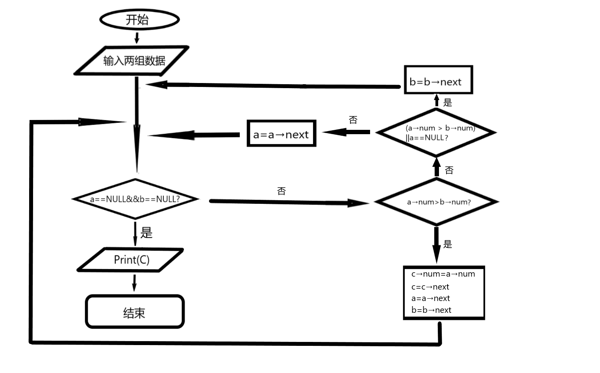
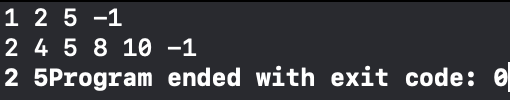
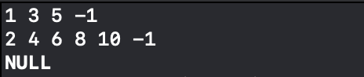
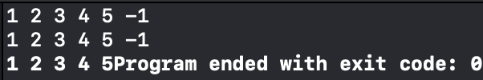
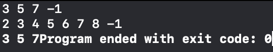
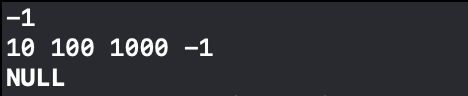

# 两个有序链表序列的交集

## 1 算法思想

采用“拉链法”求两非降序列表的交集，即从头开始比较两链表的值是否相等，若相等，则指针同时后移，如果A链表的值大于B链表的值，则B链表指针后移一位，反之，A链表指针后移一位。

当有一链表为空时，将不为空的链表的后续接在结果链表的尾部。

## 2 算法流程图



##  3 函数

### 3.1 新建链表函数

```c++
link create() {
    //带表头的节点 通过sub增加元素 所以sub一开始就要指向头结点  头结点不存任何东西   head赋值给q q指针指向head的位置
    link head = (link)malloc(sizeof(struct linklist));//创建头结点
    head->next = NULL;
    link sub = head;                                  //一个指向头结点的指针,用于遍历链表
    int num;
    while(cin >> num && num != -1) {
        link temp = (link)malloc(sizeof(struct linklist));//创建存储数据的结点
        temp->num =  num;
        temp->next = NULL;
        sub->next = temp;
        sub = temp;
    }
    return head;
}
```


### 3.2 求交集函数

```c++
link meet(link a,link b) {
    a = a->next;
    b = b->next;
    link head = (link)malloc(sizeof(struct linklist));
    head ->next = NULL;
    link p1 = head;
    while(a != NULL && b!= NULL) {
        if(a->num == b->num) {
            link p2 = (link)malloc(sizeof(struct linklist));
            p2->num = a->num;
            p2->next = NULL;
            p1->next = p2;
            p1 = p2;
            a = a->next;
            b = b->next;
        } else if((a->num > b->num) || a == NULL) {
            b = b->next;
        } else if((b->num > a->num) || b == NULL) {
            a = a->next;
        }
    }
    return head;
}
```


### 3.3 输出结果链表函数

```c++
void print(link a) {
    a = a->next;
    if(a == NULL){
        cout << "NULL" << endl;
        return;
    } else {
        while (a != NULL){
            if(a->next != NULL) {
                cout << a->num << " ";
                a = a->next;
            } else {
                cout << a->num;
                a = a->next;
            }
        }
    }
}
```


## 4 测试

### 4.1 一般情况



### 4.2 交集为空



### 4.3 完全相交



### 4.4 一个序列完全属于交集



### 4.5 一个序列为空




## 5 注意事项

在输出时结尾不能有空格，所以对于输出情况要进行一个小分类