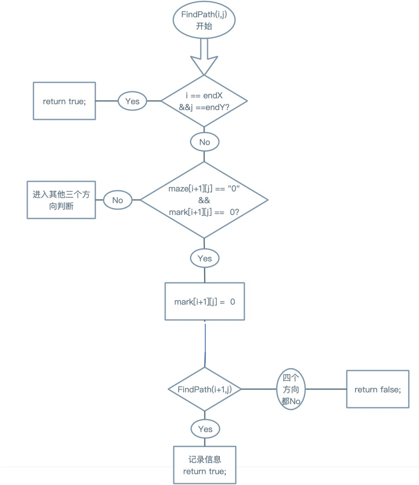
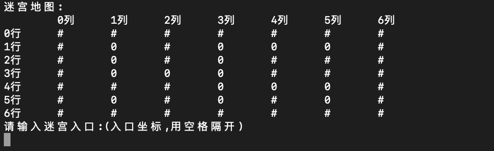
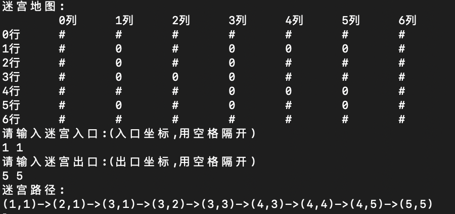

# 勇闯迷宫游戏

## 1 设计

### 1.1 数据结构设计

1. 迷宫是二维图形，故用二维数组数据结构，同时设置辅助二维数组记录迷宫中的每个点是否访问过。

2. 考虑到要输出路径，若使用回溯法输出路径的话只能输出逆向路径，故将迷宫的通路设计为链表数据结构，顺序输出从起点到终点的路径。

### 1.2 类设计

1. 迷宫与辅助数组

```c++
//测试迷宫
char maze[N][M]=
    {
        {'#','#','#','#','#','#','#'},
        {'#','0','#','0','0','0','#'},
        {'#','0','#','0','#','#','#'},
        {'#','0','0','0','#','#','#'},
        {'#','#','#','0','0','0','#'},
        {'#','0','#','0','#','0','#'},
        {'#','#','#','#','#','#','#'},
    };

int mark[N][M];//用来记录某点是否走过
```

2. 迷宫各点

```c++
struct Node {
    int X;
    int Y;
    Node* next;
};
```


## 2 算法实现

### 2.1 算法思想

采用“回溯法”，从起点开始 ，向四个方向分别进行递归，如果找到了出口，则返回true，否则继续对四个方向进行递归。在递归时，要小心数组越界，只有未访问过的点以及是可以走的点才去访问。最后如果返回true，说明找到了出口，则一层层用链表记录点的横纵坐标，最后顺序输出。

### 2.2 算法流程图



### 2.3 函数实现

```c++
bool FindPath(int i,int j) {
    if(i == endX && j == endY) {
        return true;
    } else {
      //分别向上下左右四个方向（可以用for循环+方向数组代替）
        if(maze[i+1][j] == '0' && mark[i+1][j] == 0) {
            mark[i+1][j] = 1;
            if(FindPath(i+1, j)) {
                //cout << "(" << i+1 << "," << j << ")->";//这个是反向路径
                temp = new Node;
                temp->X = i+1;
                temp->Y = j;
                temp->next = p->next;
                p->next = temp;//用单链表头插法记录路径
                mark[i+1][j] =sum;
                sum++;
                return true;
            }
        }
        if(maze[i][j+1] == '0' && mark[i][j+1] == 0) {
            mark[i][j+1] = 1;
            if(FindPath(i, j+1)) {
                temp = new Node;
                //cout << "(" << i << "," << j+1 << ")->";
                temp->X = i;
                temp->Y = j+1;
                temp->next = p->next;
                p->next = temp;
                mark[i][j+1] = sum;
                sum++;
                return true;
            }
        }
        if(maze[i-1][j] == '0' && mark[i-1][j] == 0) {
            mark[i-1][j] = 1;
            if(FindPath(i-1, j)) {
                temp = new Node;
                //cout << "(" << i-1 << "," << j << ")->";
                temp->X = i-1;
                temp->Y = j;
                temp->next = p->next;
                p->next = temp;
                mark[i-1][j] = sum;
                sum++;
                return true;
            }
        }
        if(maze[i][j-1] == '0' && mark[i][j-1] == 0) {
            mark[i][j-1] = 1;
            if(FindPath(i, j-1)) {
                temp = new Node;
                //cout << "(" << i << "," << j-1 << ")->";
                temp->X = i;
                temp->Y = j-1;
                temp->next = p->next;
                p->next = temp;
                mark[i][j-1] = sum;
                sum++;
                return true;
            }
        }

    }
    return false;
}
```

## 3 测试

### 3.1 初始迷宫



### 3.2 输入起点与终点坐标


### 3.3 显示路径



### 4 总结

在用回溯法写完之后，发现输出路径是逆向路径，一直在想办法使正向输出，一开始利用辅助数组，不是简单的将走过的点记为“1”，而是用count++不断更新走过的点的次序，这种方法在输出迷宫是可以看到正向路径，但是无法将每个点的横纵坐标取出，所以想到了结构体和链表，将每个点看做链表的一个节点，节点包括横纵坐标以及指向下一节点的指针。在本题中，使用辅助数组记录该点是否经过，也可以在结构体中多加一个布尔变量，可以起到相同的效果。