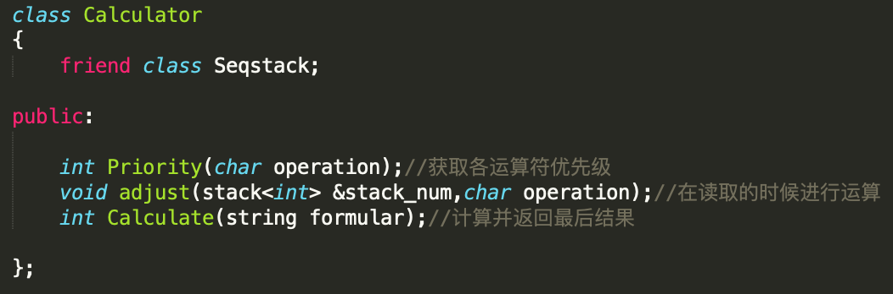
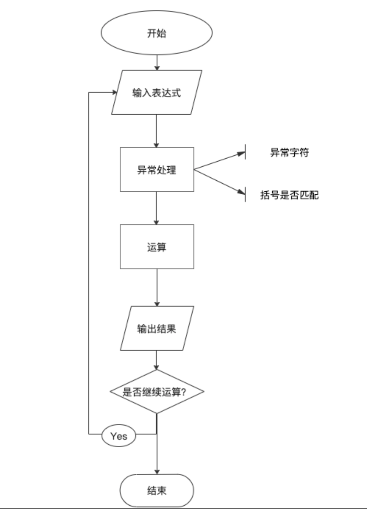
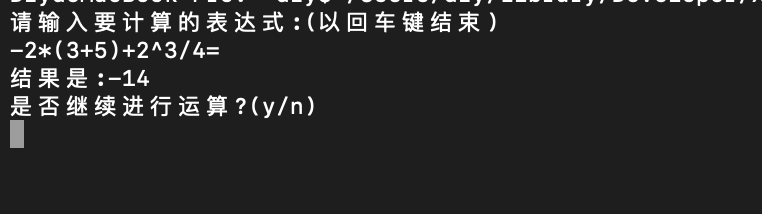
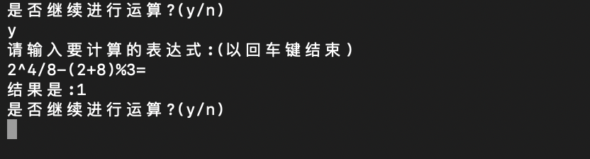
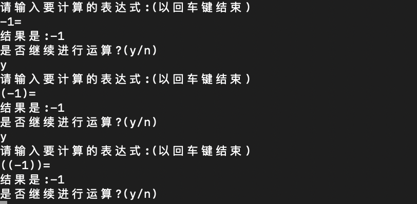
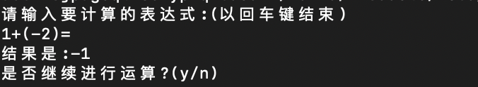
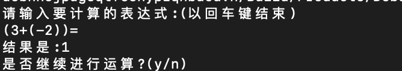
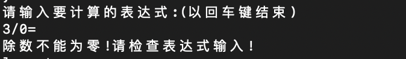
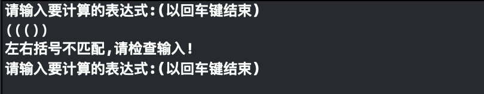
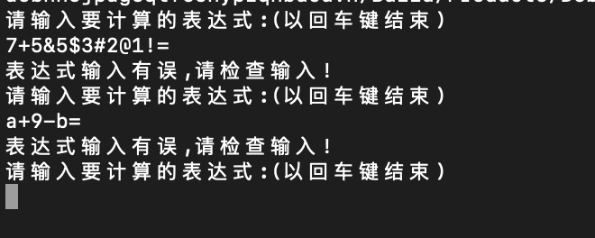

# 算数表达式求解

## 1 数据结构设计

中缀表达式数字与运算符相间，运算有次序，根据题目要求，栈有后进先出的特性，符合要求。所以设置数栈和运算符栈。

栈的操作使用STL。

运算操作：




## 2 具体实现

### 2.1 流程图



### 2.2 获取优先级函数

提前设置好优先级，使用`if`判断

```c++
int Priority(char operation) {
    //判断运算符优先级
    if(operation == '(') return 1;
    else if(operation ==  '+' || operation == '-') return 2;
    else if(operation ==  '*' || operation == '/' || operation == '%') return 3;
    else if(operation ==  '^') return 4;
    else return 5;
}
```

### 2.3 计算函数

先从传入的数栈中取出栈顶两个数，然后用传入的运算符判断运算类型，最后将算得的结果压入栈中。

```c++
void Calculate(stack<int> &stack_num,char operation) {
    int num_left,num_right,result;
    num_right = stack_num.top();
    stack_num.pop();
    if(stack_num.empty()) {
        num_left = 0;
    } else{
        num_left = stack_num.top();
        stack_num.pop();
    } 
    if(operation == '+') {
        result = num_left+num_right; 
    }
    else if (operation == '-') {
        result = num_left-num_right;
    }
    else if (operation == '*') {
        result = num_left*num_right;
    } else if (operation ==  '/') {
        if(num_right != 0) {
            result = num_left/num_right;
        } else {
            cerr << "除数不能为零!请检查表达式输入!" << endl;
            exit(1);
        }
    } else if (operation == '%') {
        result = num_left%num_right;
    } else {
        result = pow(num_left, num_right);
    }
    stack_num.push(result);
}
```

注意事项：

- 如果数栈在取出一个元素后为空，则令num_left = 0；这是为了避免第一位为负数的情况。
- 注意除数为0 的异常输入，并给出错误提示。

### 2.4 表达式处理函数

遍历读入的字符串formula：

- 如果读入的是数字，继续读后面的字符，直到不是数字，然后将这个多位数暂存入temp_num，再用atoi强制转换为int，进数栈；
- 如果读入的是运算符，先看符号栈是否为空，若符号栈为空则直接压进符号栈；符号栈不为空，取出符号栈栈顶元素（并不出栈），与当前运算符比较优先级，如果栈顶元素优先级高，则进入计算函数，如果当前元素优先级高，则将当前运算符压入符号栈；
- 如果读入的运算符是“=”，则对当前所有数栈符号栈进行运算，并返回结果；
- 如果读入的是“（”，直接入栈；
- 如果读入的是“）”，当栈顶不是“（”时直接运算；栈顶是左括号直接将左括号出栈。

在遍历完整个字符串formula后，如果符号栈不为空，弹出所有元素并计算。


```c++
	//如果读入的是数字,继续读后面的字符,直到不是数字
  //将这个多位数暂存入temp_num,再用atoi强制转换为int,进数栈
        if(formular[i] >= '0' && formular[i] <= '9') {
            j = i;
            while(j < length && formular[j] >= '0' && formular[j] <= '9') {
                j++;
            }
            temp_num = formular.substr(i,j-i);
            num_stack.push(atoi(temp_num.c_str()));
            i = j;
        }
```

```c++
//如果读入的是运算符
        else if(formular[i] == '+' ||formular[i] == '-' ||formular[i] == '*' ||formular[i] == '/' ||formular[i] == '%' ||formular[i] == '^' ){
            //先看符号栈是否为空,若符号栈为空,则此符号直接进栈
            if(operator_stack.empty()){
                operator_stack.push(formular[i]);
            }
            //如果符号栈不为空,当符号栈不为空时,取出栈顶元素,与当前运算符比较优先级,如果栈顶元素优先级高,则进行运算函数
            //如果优先级低,则跳出循环,将当前运算符入栈
            else{
                while (!operator_stack.empty()){
                    temp_op = operator_stack.top();
                    if(Priority(temp_op) >= Priority(formular[i]) && formular[i] != '^'){
                        Calculate(num_stack, temp_op);
                        operator_stack.pop();
                    }
                    else if (Priority(temp_op) > Priority(formular[i]) && formular[i] == '^'){
                        Calculate(num_stack, temp_op);
                        operator_stack.pop();
                    }
                    else break;
                }
                operator_stack.push(formular[i]);
            }
            i++;
        }
```

```c++
else if (formular[i] == '=')//如果读入等号直接对现在的所有数栈符号栈进行运算并返回结果
        {
            while (!operator_stack.empty()){
                temp_op = operator_stack.top();
                Calculate(num_stack, temp_op);
                operator_stack.pop();
            }
            return num_stack.top();
        }
```

```c++
else{   //如果读入的是左括号,直接入栈
            if(formular[i]  == '('){
                operator_stack.push(formular[i]);
            }
            else//如果读入的不是以上符号,则排除出错的话只剩右括号
            {   //当栈顶不是左括号时,进行运算
                while (operator_stack.top() != '('){
                    temp_op = operator_stack.top();
                    Calculate(num_stack, temp_op);
                    operator_stack.pop();//把当前运算符出栈
                }
                operator_stack.pop();//把左括号出栈
            }
            i++;
        }
```

**注意事项：**

进行幂运算要单独区分，连续两个“^”运算符会使结果出现问题。

### 2.5 异常检测部分

1. 表达式输入有误：将0-9和所有运算符存在judge数组中，对读入的字符串一位位对比，设置count变量计算对比次数，如果对比次数等于19（judge数组的长度），则抛出异常。

2. 除数为0：在计算是判断。

3. 左右括号不匹配：在①遍历时分别统计左右括号的数目进行比较。


## 3 测试

### 3.1 正常测试





### 3.2 单目运算符处理







### 3.3 异常检测

1. 除数为0

   

2. 左右括号不匹配

   

3. 表达式输入有误

   