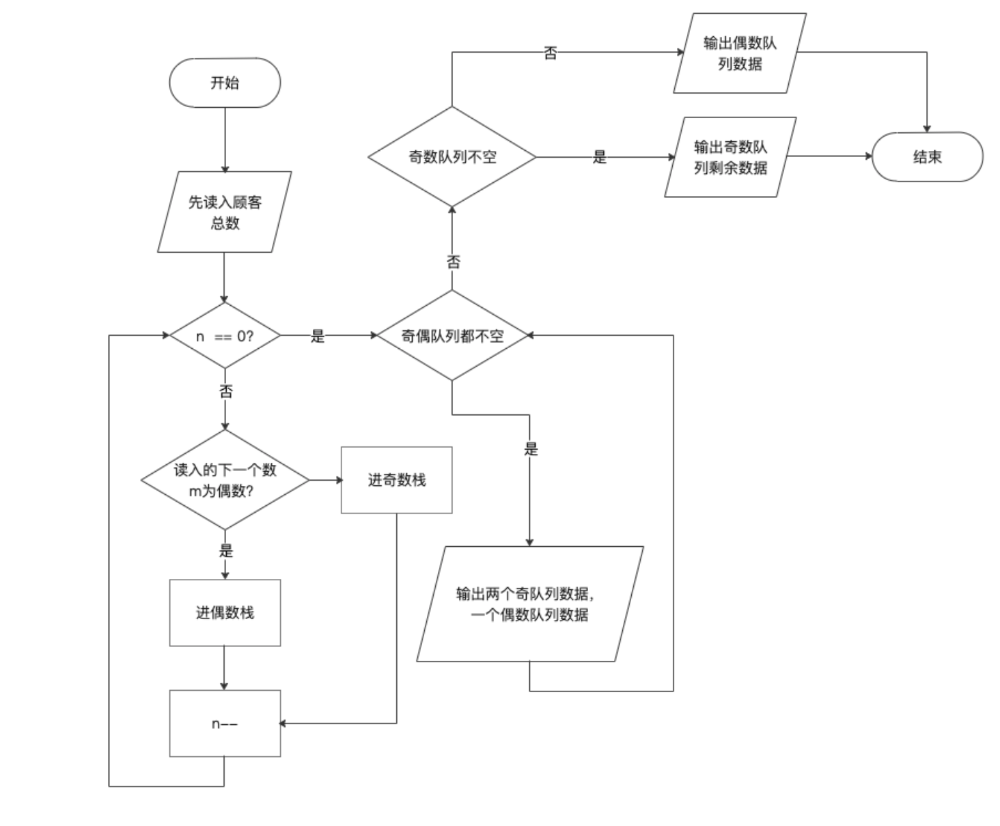

# 银行业务

## 1 数据结构设计

考虑到先来的顾客需要优先服务，符合队列“先进先出”的特点，故采用队列作为本题的数据结构。

```c++
class Queue {
public:
    int  rear;//队尾指针
    int  front[N];//存储队列元素
public:
    Queue();//构造函数
    ~Queue();//析构函数
    bool empty();//判断队列是否为空,若空则返回true
    void push(int x);//将元素x入队
    int getfront();//取队首元素
};
```

## 2 实现

### 2.1 流程图



### 2.2 判断队列是否为空

队尾指针为0，则队列为空，反之，队列不为空。

```c++
bool Queue::empty() {
    if(rear == 0){
        return true;
    } else {
        return false;
    }
}
```

### 2.3 入队函数

将X入队，设置队尾指针指向的值为X，队尾指针后移。

```c++
void Queue::push(int x) {
    front[rear] = x;
    rear++;//队尾指针后移
}

```

### 2.4 取队首函数

若队尾指针为0，则返回false；取队首元素x，将所有元素前移一位，队尾指针再减1，返回x。

```c++
int  Queue::getfront() {
    if(rear == 0) {
        return false;//若队列为空,则返回false
    }
    int x = front[0];//取队首元素
    for(int i = 0;i < rear-1;i++)//将所有元素统一前移一位 相当于stl中的pop操作
    {
        front[i] = front[i+1];
    }
    rear--;//队尾-1
    return x;
}
```

### 2.5 主要操作

先定义两个队列，在读取数据时，如果是偶数，则进入偶数队列，奇数进入奇数队列。当两队列都不为空时，输出两个奇数队列中的数据一个偶数队列中的数据，直至某一队列为空。然后再将另一个不为空的队列中的数据顺序输出即可。

```c++
while (n--) {
        cin >> m;
        //若读入数据为偶数
        if(m % 2 == 0) {
            oushu.push(m);//入偶数队列
        } else {
            jishu.push(m);//为奇数 入奇数队列
        }
    }
    //当奇偶队列都有元素时
    while(!jishu.empty() && !oushu.empty()) {
        cout << jishu.getfront() << " ";//输出两个奇数一个偶数(A窗口两个B窗口一个)
        cout << jishu.getfront() << " ";
        cout << oushu.getfront() << " ";
    }
    //若出现某一队列元素没有全部输出 分别讨论
    while(!jishu.empty()) {
        if(jishu.rear != 1) {
            cout << jishu.getfront() << " ";
        }
        else {
            cout << jishu.getfront();//只剩最后一个元素 结尾没有空格
        }
    }
    while(!oushu.empty()) {
        if(oushu.rear != 1) {
            cout << oushu.getfront() << " ";
        } else {
            cout << oushu.getfront();
        }
    }
```


## 3 测试

### 3.1 正常测试

1. A窗口人多

测试数据：8 2 1 3 9 4 11 13 15

期望输出：1 3 2 9 11 4 13 15

实际输出：1 3 2 9 11 4 13 15

2. B窗口人多

测试数据：8 2 1 3 9 4 11 12 16

期望输出：1 3 2 9 11 4 12 16

实际输出：1 3 2 9 11 4 12 16

### 3.2 最小N的测试

测试数据：1 6

期望输出：6

实际输出：6