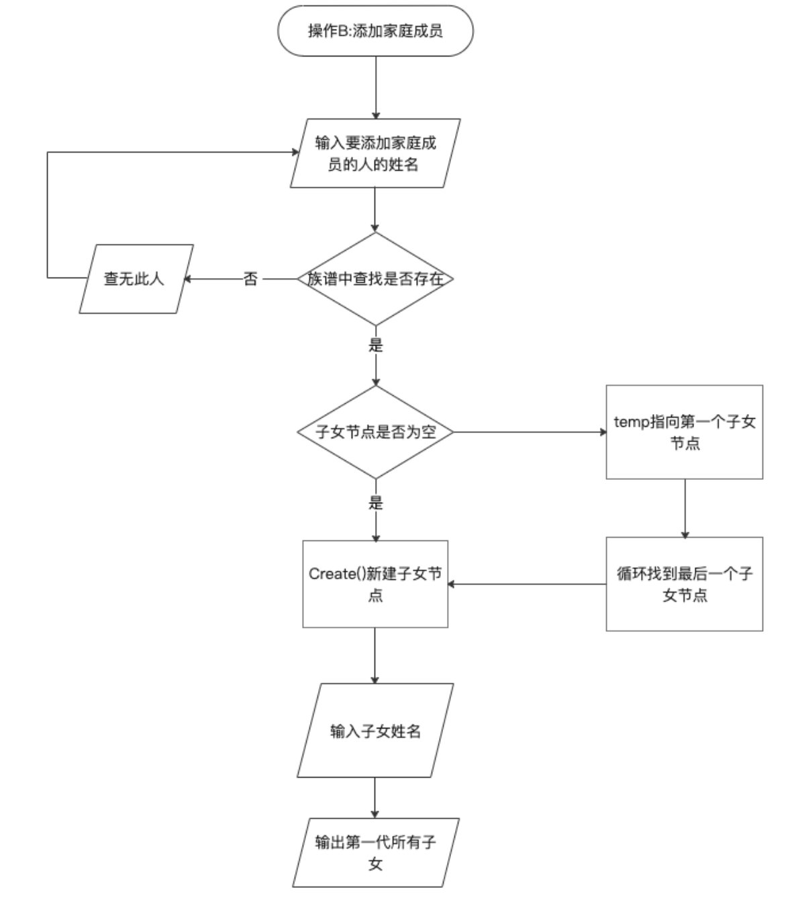

# 家谱管理系统

## 1 使用方法

### 1.1 运行程序

第一步，输入祖先的姓名。


### 1.2 完善家谱

首先输入要建立家庭的人的姓名，然后输入此人儿女的个数，再分别输入儿女的姓名。

之后会输出该人的第一代子女。


### 1.3 添加家庭成员

首先输入要添加儿女的人的姓名，然后再输入新添加儿女的姓名。

之后会输出该人第一代全部的子女。


### 1.4 解散局部家庭

输入要解散家庭的人的姓名。


### 1.5 更改家庭成员姓名

首先输入要改名的成员的姓名，再输入更改后的姓名即可完成改名。


## 2 数据结构设计

考虑到需要对家谱进行大量增加、删除、修改、查找等操作，而链表的操作特点正好符合要求，所以采用链表数据结构作为基础。家谱可以看成是一颗多叉树，所以本题最终用树的数据结构来实现功能。

设计两个类（结构体），每个家庭成员的详细信息存储在结构体中，而对于家谱的增删查改操作则通过家谱类来实现。

1. 家庭成员类

   ```c++
   //家庭成员结构体
   struct FamilyMember {
       string name;//成员姓名
       int child_num;//孩子的个数
       FamilyMember * brother_pre;//前一个兄弟姐妹
       FamilyMember * brother_next;//后一个兄弟姐妹
       FamilyMember * father;//父亲节点
       FamilyMember * child;//孩子节点
   };
   
   ```

   

2. 家谱操作类

   ```c++
   //族谱 操作类
   class FamilyTree
   {
       
   public:
       FamilyTree();//构造函数
       ~FamilyTree();//析构函数
       void Build_Ancestor();//建立祖先
       void Develop_Family();//完善家庭
       void Add_Member();//增加成员
       void Divorce_Member();//解散局部家庭
       void Change_Name();//修改成员信息
       FamilyMember * Find_Member(string name,FamilyMember * member);//查找家庭成员
       FamilyMember * Member_Create();//新建家庭成员节点
       void Show_Child(FamilyMember * father);//输出所有父节点的子节点
       
   private:
       FamilyMember * ancestor;//祖先节点
   };
   ```

## 3. 具体实现

### 3.1 总体思路

采用子女—兄弟链表表示法的二叉链表实现。Family成员结构体，对应有父指针和子指针以及前后兄弟指针，将整个家庭构造成树的结构。在添加新家庭成员时，只需在原链表尾处添加新节点并标记其父指针为原表尾。同样，解散家庭成员时，根据该成员所处位置，将其前后兄弟指针相连，并减少父节点的子孙数后删除该节点。完善家庭成员时，先输入子女个数，之后为每个子女建立新节点并与父节点相连，每个子女节点之间用兄弟指针相连，便于查找家庭成员。

### 3.2 操作A：完善家谱

得到家庭成员姓名后，在家谱中查找该成员。如果没有找到，则报错：“查无此人，请重新输入！”。如果找到，则对其孩子节点进行判断，如果孩子节点不为空，则说明已经建立过家庭；孩子节点为空则需要输入孩子的个数和各个孩子的名字，然后再循环添加子女到树中。


```c++
//操作A 完善家庭
void FamilyTree::Develop_Family() {
start :cout << "请输入要建立家庭的人的姓名:";
    string name;
    cin >> name;
    FamilyMember *p = Find_Member(name, ancestor);
    if(p == NULL) {
        cout << "查无此人!" << "请检查输入!" << endl;
        goto start;
    }
    if(p->child != NULL) {
        cout << "已经建立过家庭!" << "请检查输入!" << endl;
        goto start;
    }
    cout << "请输入" << p->name << "儿女人数:";
    cin >> p->child_num;
    if(p->child_num == 0) {
        cout << p->name << "没有儿女!" << endl;
        return;
    }
    cout << "请依次输入" << p->name << "的儿女的姓名:";
    p->child = Member_Create();
    FamilyMember * temp = p->child;
    cin >> temp->name;
    temp->father = p;// temp （指向头结点的指针，类似于head是头结点 要有p指向头结点 操作p）
    for(int i = 0;i < p->child_num-1;i++)//循环创建所有子女节点并用 循环链表 连接 {
        FamilyMember * brother = Member_Create();
        cin >> brother->name;
        brother->father = p;
        brother->brother_pre = temp;
        temp->brother_next = brother;
        temp = temp->brother_next;
    }
    Show_Child(p);
}
```

### 3.3 **操作B：添加家庭成员**

首先输入要添加儿子或女儿的人的姓名，在家谱中查找此人，如果未找到则报错，找到的话需要进行进一步判断，如果此人孩子节点为空，则通过Member_create()函数新建孩子节点并添加到族谱中；如果此人子节点不为空，则对其孩子节点操作，循环找到子节点最后一个，然后加入新节点。



```c++
//操作B 添加家庭成员
void FamilyTree::Add_Member() {
start:string name;
    cout << "请输入要添加儿子或女儿的人的姓名:";
    cin >> name;
    FamilyMember * p = Find_Member(name, ancestor);
    if(p == NULL)
    {
        cout << "查无此人!请检查输入!" << endl;
        goto start;
    }
    cout << "请输入" << p->name << "新添加的儿子或女儿的姓名:";
    FamilyMember * child = Member_Create();
    if(p->child == NULL) {
        child->father = p;
        p->child = child;
        cin >> child->name;
        p->child_num = 1;
    } else {
        FamilyMember * q = p->child;
        for(int i = 0;i < p->child_num-1;i++) {
            q = q->brother_next;
        }
        cin >> child->name;
        child->father = p;
        q->brother_next = child;
        child->brother_pre = q;
        p->child_num++;
    }
    Show_Child(p);
}
```

### 3.4 操作C：解散局部家庭

同前面操作，在族谱中找到要解散家庭的人。如果他的孩子节点为空，则输出“尚未建立家庭！”，如果孩子节点不为空，需要分情况继续讨论，判断此人是否有兄弟指针，让前后兄弟指针相连接或置为空，并让父节点的孩子数减一，再删除该节点。


```c++
//操作C 解散局部家庭
void FamilyTree::Divorce_Member() {
start:cout << "请输入要解散家庭的人的姓名:";
    string name;
    cin >> name;
    FamilyMember * p = Find_Member(name, ancestor);
    if(p == NULL) {
        cout << "查无此人!请检查输入!" << endl;
        goto start;
    }
    if(p->child == NULL) {
        cout << p->name << "尚未成立家庭!";
        return;
    }
    if (p->brother_pre != NULL && p->brother_next != NULL) {
        p->brother_pre->brother_next = p->brother_next;
        p->brother_next->brother_pre = p->brother_pre;
    } else if (p->brother_pre != NULL && p->brother_next == NULL) {
        p->brother_pre->brother_next = NULL;
    } else if (p->brother_pre == NULL && p->brother_next != NULL) {
        p->father->child = p->brother_next;
        p->brother_next->brother_pre = NULL;
    } else {
        p->father->child = NULL;
    }
    p->father->child_num--;
    cout << "要解散家庭的人是:" << p->name << endl;
    Show_Child(p);
    delete p;
}
```

### 3.5 操作D：更改家庭成员姓名

```c++
//操作D 更改家庭成员姓名
void FamilyTree::Change_Name() {
 start: cout << "请输入要更改姓名的人的目前的姓名:";
    string name,old_name;
    cin >> name;
    FamilyMember * p = Find_Member(name, ancestor);
    if(p == NULL) {
        cout << "查无此人!请检查输入!" << endl;
        goto start;
    }
    old_name = p->name;
    cout << "请输入" << p->name << "更改后的姓名:";
    cin >> name;
    p->name = name;
    cout << old_name << "已更名为" << p->name;
}
```

### 3.6 查找家庭成员函数

先判断传入的member是否为要查找的人，再对其兄弟节点和孩子节点进行递归查找。

```c++
//查找名为name的家庭成员是否存在
FamilyMember * FamilyTree::Find_Member(string name, FamilyMember * member) {
    FamilyMember * p = member,*temp = p,*brother = NULL;
    //如果传入的member就是要查找的人,则返回member
    if(p->name == name){
        return p;
    }
    //如果member不是,递归查找member的兄弟
    while (temp->brother_next) {
        brother = Find_Member(name, temp->brother_next);//递归找完所有兄弟 还没有找到的话就从最后一个兄弟的儿子倒着往回找
        if(brother) {
            return brother;
        }
        temp = temp->brother_next;
    }
    temp = p;
    //从孩子倒着往回找
    if(temp->child){
        brother = Find_Member(name, temp->child);
    }
    return brother;
}
```


## 4 出错测试

### 4.1 查无此人

如果在进行A、B、C、D操作时输入了家谱中不存在的成员姓名，则会报错：“查无此人！”


### 4.2 已经建立过家庭

完善家庭操作只适用于没有建立家庭的成员，建立家庭后只可以通过增加家庭成员或者解散后重建来实现更改。


### 4.3 尚未成立家庭

在进行解散操作是，如果A尚未建立家庭，则不可以进行解散操作，会有提示信息：“A尚未建立家庭！”


### 4.4 ChildNum == 0

完善家庭时，如果输入的孩子个数为0，则会有提示信息：“没有子女！”


### 4.5 注意事项

1. 在解散局部家庭时不可以解散“祖先”的局部家庭。

2. 输出子孙信息只可以输出第一代。


## 5 自我小结

家谱管理系统的完成使我感到了一丝成就感，因为在初次拿到设计题目时，我是一筹莫展的。又一次亲手设计了数据结构与类，实现起来十分方便，美中不足的是并不能像生活中的家谱那样全部输出展示出来，这用到了很多没有学到的知识。

在设计过程中，经过同学的一些提醒，更正了不少细节的问题，比如解散局部家庭时对于兄弟节点的多种情况进行讨论。使用链表时，时刻要注意它的指向各个节点的指针是否为空，“牵一发而动全身”，删除此节点需要在链表中把与该节点所有相关的信息都进行更改，以后处理时需要更加仔细。

本次设计中族谱建立使用了“兄弟-子女”表示法，源于数据结构的教材，在我初学树这种数据结构时，我并没有想到这种方法，现在也很有收获。

另一个存在的问题就是成员的查找——用递归实现。即先找兄弟节点，若兄弟节点中没有找到再对子女节点进行递归。这里是要区分递归与循环的区别的。递归是对下一级的同类型的数据进行递归，而循环是对同级的数据在一定范围内进行循环，一开始我不理解为什么子女节点要递归而兄弟节点要循环。在写递归或者循环代码的时候，伪代码是十分重要的，根据伪代码来写，很快就会有结果，而空想就很抽象。这一点在后面排序算法的比较中我也深有体会。