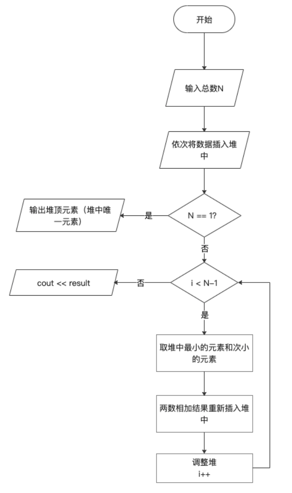
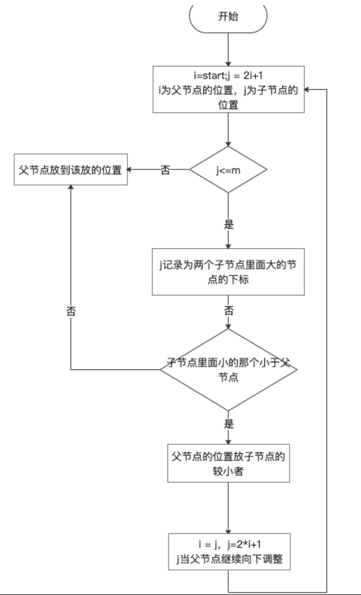

# 修理牧场

## 1 数据结构设计

经过分析发现，先从数据中选出最小的两个来，将他们的和放进这些数据，重复这个步骤，就可以得到具体的切割方法，这也就是最小生成树的思想。经过数据结构课本介绍，最小生成树又称为哈夫曼树。

哈夫曼树的实现通过建立最小堆来完成，由于本题只需要输出最后的最小结构，故不需要树的设计，只用最小堆即可实现。

```c++
//最小堆类定义
class MinHeap {
public:
    MinHeap(int size = N);
    ~MinHeap() {
        delete []heap;
    }
    void Insert(int x);
    int RemoveMin();
    
    int * heap;
    int currentSize;
    void siftDown(int start,int m);
    void siftUp(int start);
};
```


## 2 具体实现

将所有长度循环插入堆中，进行调成，成为最小堆，堆顶为最小数，然后取出堆中最小的两个数，将他们两个相加的结果再插入堆中，进行调整，直至调整N-1次，输出最后结果。结果从0开始，每次将取出两数的和加入到result中，最后输出result。



### 2.1 堆的下滑调整函数

从start到m 由上到下如果子节点小于父节点，则子节点上浮，继续向下比较 将一个局部调整为最小堆。



```c++
//最小堆下滑调整算法
void MinHeap::siftDown(int start, int m) {
//从start到m 由上到下 如果子节点小于父节点 则子节点上浮 继续向下比较 将一个局部调整为最小堆
    int i = start, j = 2*i+1;//i为父节点在二叉树中的序号,j为子节点在二叉树中的序号
    int temp = heap[i];//将父节点的关键码记录
    while(j <= m) {
    //让j指向两个子女中的较小者
        if(j < m && heap[j] > heap[j+1]){
            j++;
        }
        //子节点小于父节点 子节点上浮
        if(heap[j] >= temp) {
            break;
        } else {
            heap[i] = heap[j];
            i = j;//继续向下比较
            j = 2*i+1;
        }
    }
    heap[i] = temp;//比完将temp放到他该在的地方
}
```


### 2.2 堆的向上比较函数

同下滑比较函数相同，只不过父节点小于子节点，父节点下移。然后继续向上比较，原来父节点的指针现在为子节点。

```c++
//向上比较函数
void MinHeap::siftUp(int start) {
    int j = start,i=(j - 1)/2;
    int temp = heap[j];
    while(j > 0) {
    //父节点小于子节点 不交换
        if(heap[i] <= temp) {
            break;
        }
        //父节点大于子节点 交换
        else{
            heap[j] = heap[i];
            j = i;
            i = (i-1)/2;//循环终止条件是j<=0;比完一个父节点和子节点以后 继续往上比较j变成原来父节点在树中的次序,i变成新的父节点的次序
        }
    }
    heap[j] = temp;//将最下面的这个子节点 送到他该在的位置j
}
```

### 2.3 插入堆函数

简单的插入操作，再每次插入后向上调整，因为插入的元素在末尾。如果插在头部，则用下滑调整函数。

```c++
void MinHeap::Insert(int x) {
    heap[currentSize] = x;
    siftUp(currentSize);
    currentSize++;
}
```

### 2.4 取出堆中最小的数

因为是最小堆，所有堆顶元素为最小值，取出堆顶元素后，将堆末尾的元素（最大值）调到堆顶，然后再进行下滑调整函数，重新构建最小堆。

```c++
//取出最小堆中最小的数（即为heap[0]）,再讲最小堆重新排序
int MinHeap::RemoveMin() {
		//堆空
    if(!currentSize) {
        cout << "Heap EMPTY!" << endl;
        return false;
    }
    int x = heap[0];
    heap[0] = heap[currentSize - 1];
    currentSize--;
    siftDown(0,currentSize-1);
    return x;
}
```

