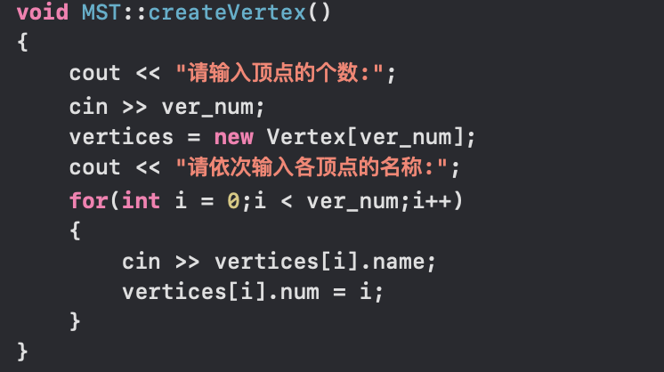

## 电网建设造价模拟系统

## 1 使用手册

### 1.1 运行程序

第一步必须创建电网的顶点，否则无法进行后续操作。


### 1.2 创建电网的顶点

首先输入顶点的个数


然后再输入各个顶点的名称


### 1.3 添加电网的边

有n个顶点便有2*n-1条边，要求每两个顶点之间都有边输入，如果不存在边则输入999。


### 1.4 **构造最小生成树**

需要输入树的起始顶点。


### 1.5 显示最小生成树


## 2 数据结构设计

本题要求做小生成树，根据Prim算法，需要不断的从树中已有节点去找与他相连的树外的权值最小的节点，故采用队列数据结构来实现树。

设计两个结构体，分别是顶点结构体和边节点结构体。顶点结构体存储顶点的序号（用于后续操作）和顶点名称。树节点结构体包括生成边节点的头、尾以及边的权值。

设计一个MST类，实现各种操作。

```c++
class MST {

public:
    int ver_num;//图节点的个数
    Vertex *vertices;//顶点的结构体数组
    int **edge_value;//图中各条边的权值
    queue <Tree> MSTree;//创建一个结构体队列来输出最小生成树
    MST();//构造函数
    ~MST();//析构函数
    void createVertex();//创建顶点
    void showVertxe();//输出所有顶点
    void addEdge();//增加图的边c
    void showEdge();//输出图的邻接矩阵
    void createTree();//生成最小生成树
    void displayTree();//输出最小生成树
};
```

生成树边节点：

```c++
struct Tree {
    string head; //生成树边节点的头
    string tail; //生成树边节点的尾
    int cost;    //生成树边的权值
};
```

顶点结构体：

```c++
struct Vertex    {
    int num;    //顶点的序号
    string name;//顶点的名字
};
```


## 3 具体实现

本题中心思想是逐个将顶点连通来构造最小生成树，从连通网络中的某一顶点出发，将起点加入生成树的集合中，选择与它关联的权最小的边，将其终点加入到生成树的集合中，之后每一步从一个顶点在生成树的集合中，和另一个不在生成树的集合中的点集中找到权值最小的边加入生成树的边集中，直到所有顶点加入生成树集合中。

### 3.1 **操作A：创建电网的顶点**

循环读入电网节点的名字，并将他的序号记录下来。



### 3.2 **操作B：添加电网的边**

用邻接矩阵存储图中边的权值，初始化为INFINITY=999，表示顶点之间没有边。读入a和b以及权值，然后在顶点数组中寻找a和b并记录他们的num（在邻接矩阵中的下标），然后将权值存入邻接矩阵中。


```c++
void MST::addEdge()
{
    edge_value = new int*[ver_num];
    for(int i = 0;i < ver_num;i++) {
        edge_value[i] = new int[ver_num];
    }
    for(int i = 0;i < ver_num;i++) {
        for(int j = 0;j < ver_num;j++) {
            edge_value[i][j] = INFINITY;
        }
    }
    string a,b;
    int a_num = -1,b_num = -1,value;
    for(int i = 0;i < ver_num*(ver_num-1)/2;i++) {
s:      cout << "请依次输入两个顶点及边:(如果两顶点间不存在边则输入权值为999)";
        cin >> a >> b >> value;
        for(int j = 0;j < ver_num;j++){
            if(vertices[j].name == a) {
                a_num = j;
            } else if(vertices[j].name == b) {
                b_num = j;
            }
        }
        if(a_num == -1 || b_num == -1 || a_num == b_num) {
            cout << "输入顶点有误!请重新输入!" << endl;
            goto s;
        } else {
            edge_value[a_num][b_num] = value;
            edge_value[b_num][a_num] = value;
        }
    }
}
```

### 3.3 操作C：生成最小生成树

开辟两个新的数组，*lowcost用于存放生成树顶点集合内顶点到生成树外各顶点的各边上的当前最小权值，*nearvex用于存放生成树顶点集合外各顶点距离集合内哪个顶点最近（权值最小），存放的是顶点。

读入树的起点，将nearvex数组初始化为起点，lowcost数组初始化为邻接矩阵中与起点的边的权值。通过循环找到权值最小且不在树内的点，插入树中。由于树中插入了新的节点，所以要更新lowcost数组和nearvex数组，然后进行顶点个数-1次循环即可生成最小生成树。


```c++
for(int i = 0; i < ver_num;i++) {
        lowcost[i] = edge_value[start_num][i];
        nearvex[i] = start_num;
    }
    nearvex[start_num] = -1;//起点的最近顶点设置为-1表示已经在生成树顶点集合内
    for(int i = 0;i < ver_num;i++) {
        int mincost = INFINITY,v = start_num;
        for(int j = 0;j < ver_num;j++) {
            if(nearvex[j] != -1 && lowcost[j] < mincost) {
                v = j;
                mincost = lowcost[j];
            }
        }//forj
        if(v != start_num) {
            for(int k = 0; k < ver_num;k++) {
                if(v == vertices[k].num) {
                    T.tail = vertices[k].name;
                } else if(nearvex[v] == vertices[k].num) {
                    T.head = vertices[k].name;
                }
            }
            T.cost = mincost;
            MSTree.push(T);
            count++;
            nearvex[v] = -1;
            for(int j = 0;j < ver_num;j++) {
                if(nearvex[j] != -1 && edge_value[v][j] < lowcost[j])
                {
                    lowcost[j] = edge_value[v][j];
                    nearvex[j] = v;
                }
            }
        }
    }//for i
```


## 4 出错测试

### 4.1 **创建边时节点不存在**


### 4.2 构造树时起点不存在


### 4.3 最小生成树不存在


### 4.4 注意事项

1. 四个操作只能从A到D进行，必须先输入顶点，再输入边的权值然后才可以生成最小生成树。

2. 创建边时，如果输入的顶点不在图中，会有提示信息“顶点不存在，请重新输入顶点！”

3. 最小生成树并不唯一。