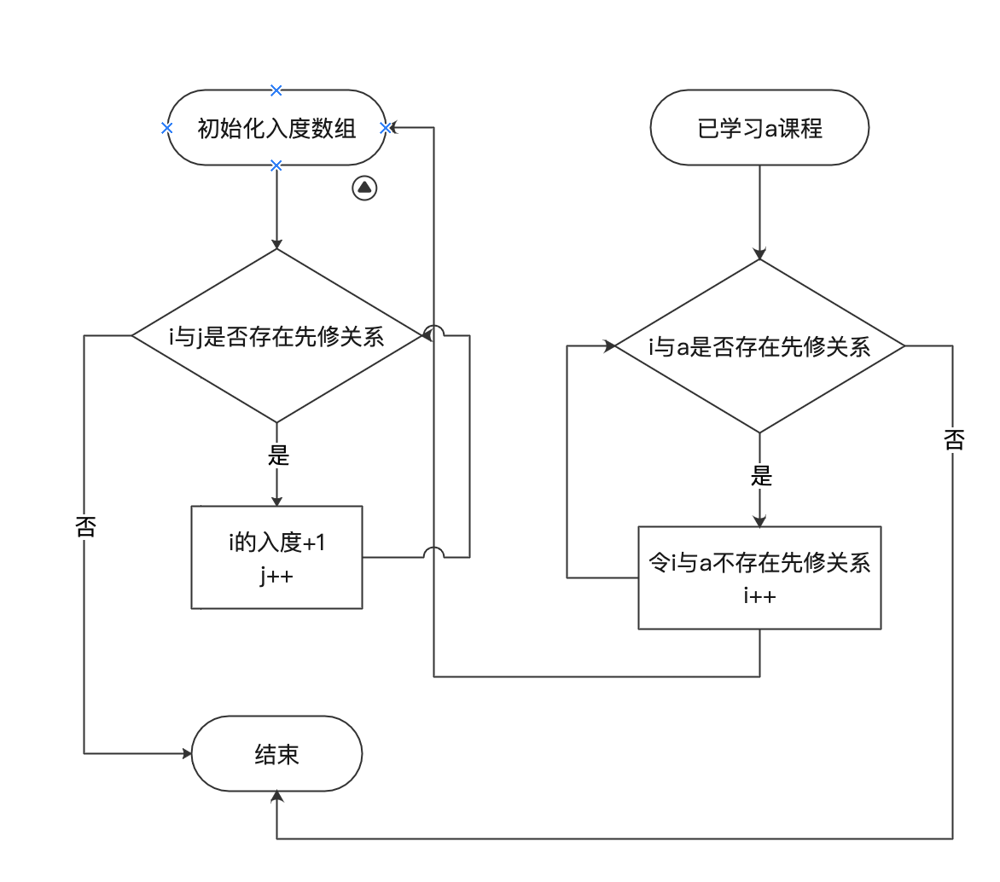
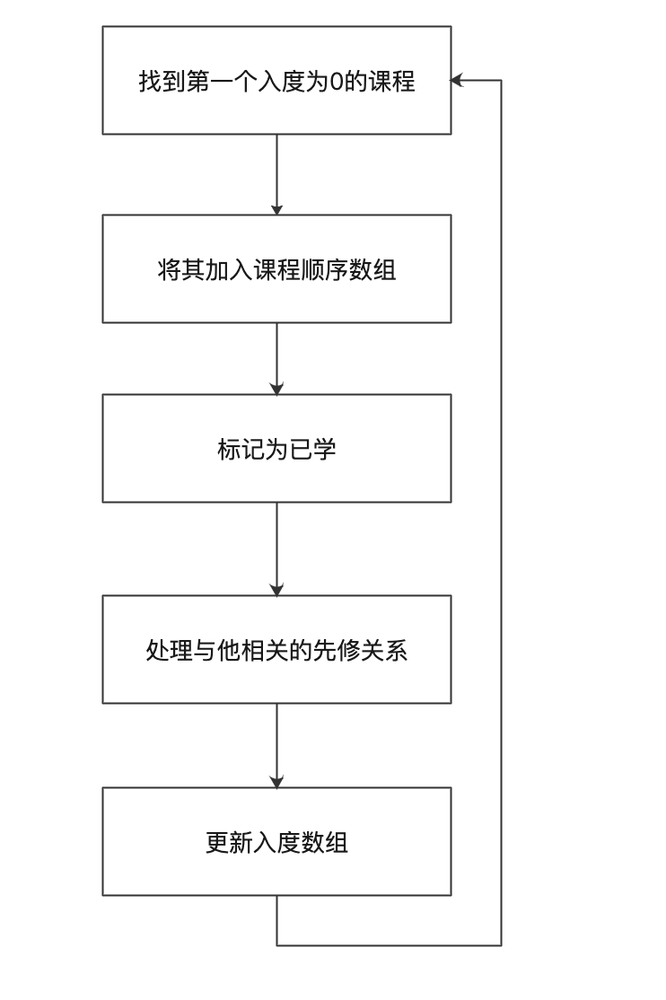
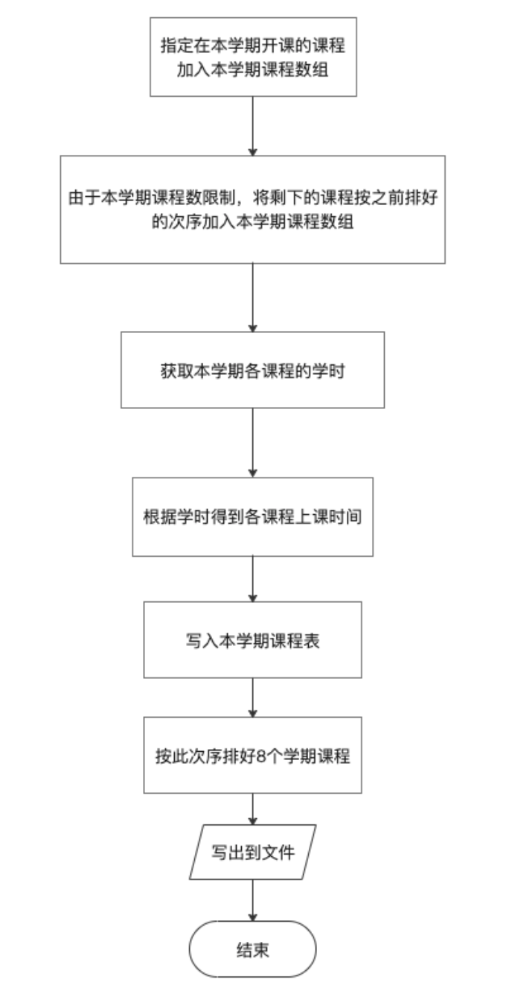
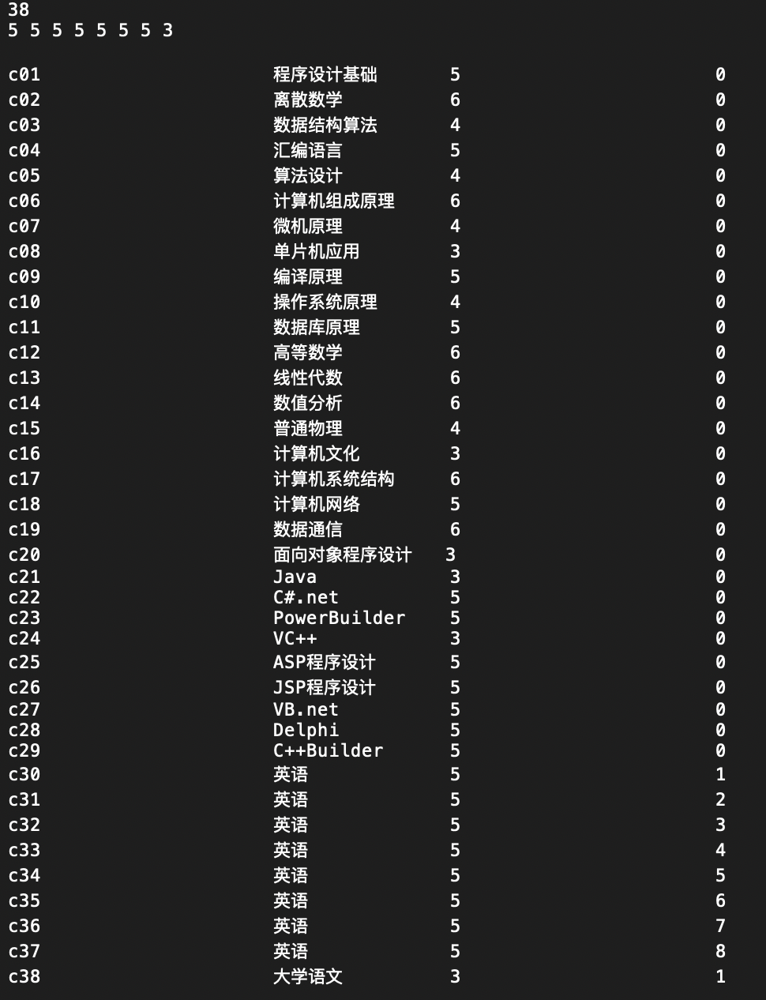
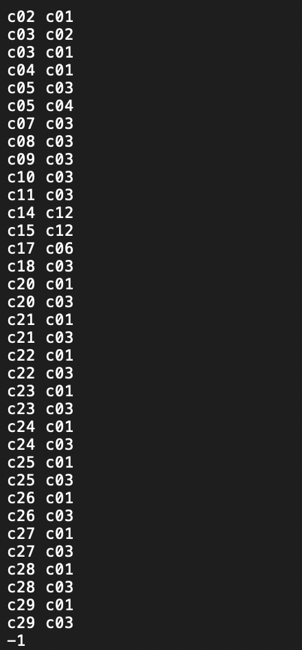
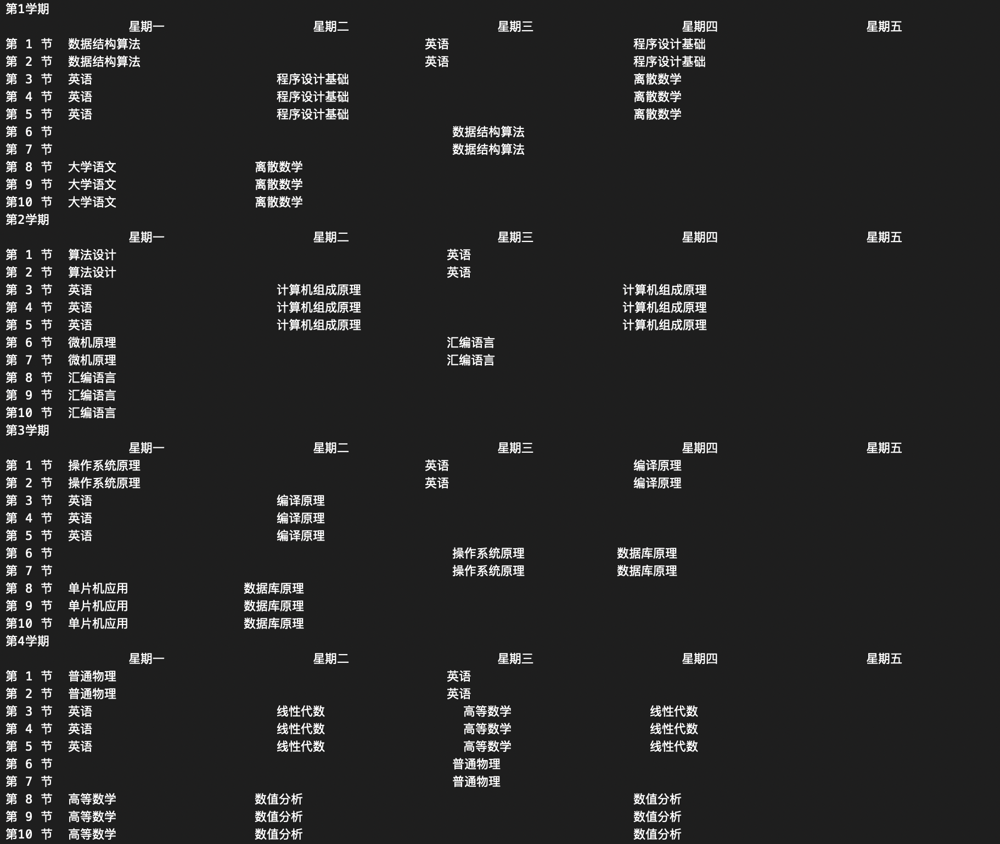
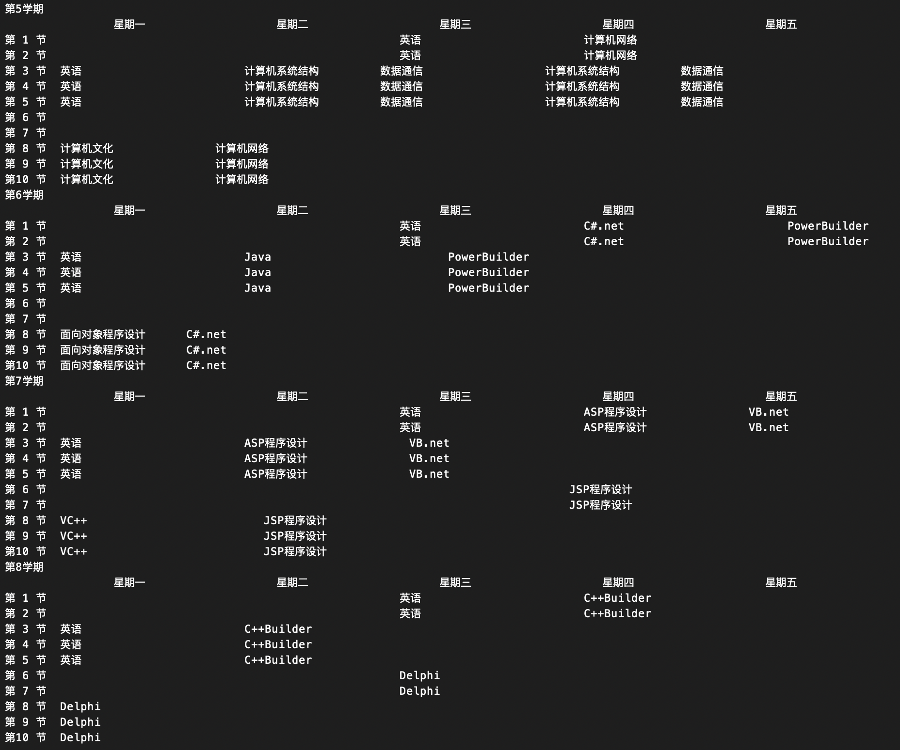

# 排课软件

## 1 数据结构设计

由于课程之间存在先修关系，所以排课实际上可以看做是活动的网络，故采用图数据结构。而课程表的输出采用二维数组数据结构。

设计一个课程结构体，其中成员包括课程序号、课程名称、开课学期、周学时数等。

设计一个排课类，包括各函数实现以及课程信息及辅助信息的实现。

1. 课程结构体

   num是指该课程在邻接矩阵中的下标，也是AOV或AOE活动网络的序号。

   ```c++
   struct Course {
       int num;//下标
       string id;//课程序号
       string name;//课程名称
       int period;//周学时数
       int term;//开课学期
   };
   
   ```

2. Arrangement类

   ```c++
   class Arrangement {
   public:
       int total;//课程总数
       int term_course[8];//每学期课程数
       Course * course;//课程数组 存储课程信息
       int **precourse;//先修关系
       queue<int> order;//队列暂时存储入度为0的顶点
       string * course_order;//存储上课的次序
       int * indegree;//入度数组
       string ** timetable;//初始化课程表用二维数组
   
   public:
       Arrangement(){}
       ~Arrangement(){}
       void ReadInfo();//读入相关条件
       void getInDegree();//更新入度数组
       void getInDegree(int i);
       void TopoLogicalOrder();//拓扑排序
       int InsertCourse(string course,int period);//将课程插到课程表中
       void InsertCourse(string course,int period,int weekday);//将课程插到课程表中
       void TimeTable();//建立课程表
   };
   ```

   其中关于课程的信息有课程总数、每学期课程数、课程之间的先修关系 （邻接矩阵），以及辅助存储：入度为0的队列、入度数组和课程先后顺序，课程表。

   函数部分通过ReadInfo()从文件中读入课程所有信息，由于采用AOV活动网络的处理——进行拓扑排序，所以有辅助函数getIndegree()，更新入度数组。在建立课程表时，也要根据课程的指定信息将课程插入表中，固有辅助函数InsertCourse()

## 2 实现过程

### 2.1 总体思路

读入信息——>拓扑排序——>按照课时等要求排课——>文件输出课程表

### 2.2 读取信息

将课程信息分为4个部分，第一部分是课程总数和每个学期课程数，如果每个学期课程数之和与课程总数不相等则抛出异常，要求用户检查，结束程序。第二部分是课程信息，按照序号、名称、学时、开课学期一次排列。第三部分是先修关系，如c02的先修课程是c01和c03，则输入c02 c01 c02 c03，每次建立一个先修关系，输入-1表示先修关系结束。

第一部分：用ifstream()打开文件并开始读取总数与各个学期课程数，若不相等则退出程序。

```c++
ifstream info("/Users/dzy/desktop/course.txt");
    if(!info){
        cerr << "文件打开失败！" << endl;
        dzy = false;
        return;
    }
    info >> total;
    
    int sum = 0;
    for(int i = 0;i < 8;i++){
        info >> term_course[i];
        sum = sum + term_course[i];
    }
    
    if(sum != total){
        cerr << "每学期课程数之和与总课程数不相等！" << endl;
        dzy = false;
        return;
    }
```

第二部分：依次读入课程信息

```c++
course = new Course[total];
for(int i = 0;i < total;i++) {
    info >> course[i].id >> course[i].name >> course[i].period >> course[i].term;
    course[i].num = i;
}
```

第三部分：读入先修关系并关闭文件

```c++
//初始化邻接矩阵(先修关系二维数组)
//-1表示没有先修关系 precourse[0][1]=1表示0的先修是1
precourse = new int*[total];
for(int i = 0;i < total;i++) {
    precourse[i] = new int[total];
}
for(int i = 0;i < total;i++) {
    for(int j = 0;j < total;j++) {
        precourse[i][j] = -1;
    }
}

string a,b;
int m = -1 ,n = -1;
info >> a;
while(a != "-1") {
    info >> b;
    for(int i = 0;i < total;i++) {
        if(course[i].id == a) {
            m = course[i].num;
        } else if(course[i].id == b) {
            n = course[i].num;
        }
    }
    if(m != -1 && n != -1) {
        precourse[m][n] = 1;
    }
    info >> a;
}
info.close();
```

### 2.3 更新入度数组

初始化：indegree数组全部初始化为0，若previous[i][j] == 1（i，j之间有先修关系），则indegree[i]++，邻接矩阵中，某一顶点的入度为矩阵一行中所有的“1”相加。

更新：若已经学习某门课程，则将与这门课程相关的所有先修关系改为-1，然后再次调用上面的初始化函数重新获得入度数组。



```c++
void Arrangement::getInDegree() {
    indegree = new int[total];
    for(int i = 0; i < total;i++) {
        indegree[i] = 0;
        for(int j = 0;j < total;j++) {
            if(precourse[i][j] == 1) {
                indegree[i]++;
            }
        }
    }
}

void Arrangement::getInDegree(int a) {
    //以a为先修课程的课的入度-1 即先修关系为-1 不存在先修因为a已经学了
    for(int i = 0;i < total;i++) {
        if(precourse[i][a] == 1) {
            precourse[i][a] = -1;
        }
    }
    getInDegree();//重新获得入度数组
}
```

### 2.4 拓扑排序

在全部课程中，找到一个入度为0的课程，将他加入课程顺序数组中，删去这个课程（标记为已经学过），并且处理它的先修关系，然后更新入度数组，循环进行以上步骤，直至全部课程学完。如果课程没有学完但是已经没有入度为0的课程了，则说明AOV网络中存在有向环。



```c++
		course_order = new string[total];//初始化顺序数组
  	for(int i  = 0;i < total; i++) {
        if(indegree[i] == 0) {
            order.push(i);
            getInDegree(i);
            break;//找到一个就进入下面的循环
        }
    }
    //队列不空且输出顶点个数小于总数
    while(!order.empty() && count < total){
        int j =  order.front();
        order.pop();
        for(int i = 0;i < total;i++) {
            if(course[i].num == j) {
                //cout << course[i].id << "    ";
                course_order[k] = course[i].name;
                course[i].num  = k-1000;//删去这个顶点
                count++;
                k++;
            }
        }
        for(int i = 0;i < total;i++) {
            if(indegree[i] == 0 && course[i].num >= 0) {
                order.push(i);
                getInDegree(i);//删去与i顶点相关的边
                break;
            }
        }
    }
```

### 2.5 **文件输出课程表**

因为有8个学期，所以循环进行8次。

在循环内，新建本学期课程数组、本学期课程学时数组以及初始化本学期课程表。然后进行本学期排课。

先将指定在本学期开课的课程加入到本学期课程数组中，然后将排好序且未指定开课学期的课程加入到本学期课程数组中，并记录他们的学时。根据不同的学时，运用InsertCourse()函数获取该课程按要求应该排的星期，再将他们插入课程表中。最后将课程表写出到文件中。



```c++
//---------把课程分到8个学期--------//
//指定在本学期开课的课程加入本学期的课程数组
        for(int j = 0;j < total;j++) {
            if(course[j].term == i+1 && count2 < term_course[i]) {
                this_term_course[count1] = course[j].name;
                course_order[course[j].num+1000] = "NULL";//上过的课做个标记
                count1++;
                count2++;
            }
        }
        for(int j = 0;j < total && count1 < term_course[i];j++) {
            if(course_order[j] != "NULL") {
                int now_term = -1;
                for(int k = 0; k < total;k++) {
                    if(course[k].name == course_order[j]) {
                        now_term = course[k].term;
                    }
                }
                if( now_term == 0) {
                    this_term_course[count1++] = course_order[j];
                    course_order[j] = "NULL";
                }
            }
        }
        table << "第"<< i+1 << "学期"<< endl;
        //---------把课程分到8个学期--------//
        //---------每个学期按学时分配--------//
        for(int j = 0; j < term_course[i];j++) {
            for(int k = 0; k < total;k++) {
                if(course[k].name == this_term_course[j]) {
                    xueshi[j] = course[k].period;
                }
            }
        }
        for(int j = 0; j < term_course[i];j++) {
            int weekday = 0;
            if(xueshi[j] ==  3) {
                weekday = InsertCourse(this_term_course[j],3);
                if(weekday == -1) {
                    weekday = InsertCourse(this_term_course[j],2);
                    weekday = weekday+2 < 5? weekday+2:weekday;
                    InsertCourse(this_term_course[j], 1, weekday);
                }
            } else if (xueshi[j] == 4) {
                weekday = InsertCourse(this_term_course[j],2);
                weekday = weekday+2 < 5? weekday+2:weekday;
                InsertCourse(this_term_course[j], 2, weekday);
            } else if (xueshi[j] == 5) {
                weekday = InsertCourse(this_term_course[j],3);
                weekday = weekday+2 < 5? weekday+2:weekday;
                InsertCourse(this_term_course[j], 2, weekday);
            } else {
                weekday = InsertCourse(this_term_course[j],3);
                weekday = weekday+2 < 5? weekday+2:weekday;
                InsertCourse(this_term_course[j], 3, weekday);
            }
        }
```


## 3 运行结果

### 3.1 输入文件(course.txt)





### 3.2 输出课表






## 4 注意事项

### 4.1 关于读取文件的格式

课程总数

各学期课程数（8个）（这九个数字用空格分开，可以不换行）

各课程序号	名称	学时	开课学期（用空格分开，可以不换行）

先修关系格式看上图示例。

### 4.2 输出文件

输出的txt文件存放在程序目录下。


## 5 自我小结

本题由于要求较多，实现起来在细节处很容易弄混，比如我创建的各个辅助数组，经常搞混他们的作用。

AOV网络的拓扑排序在每输出一个顶点后，要删去这个顶点以及与它相连的全部边，再次进行排序，直至网络中所有顶点均输出或者发现网络中有有向环。

本题设计中也采用了函数重载与文件读写，将一些新的没有用过的东西加以应用，收获颇丰。

这个项目用时较长，完成的时候看到自己排好的课表也是有一种成就感。