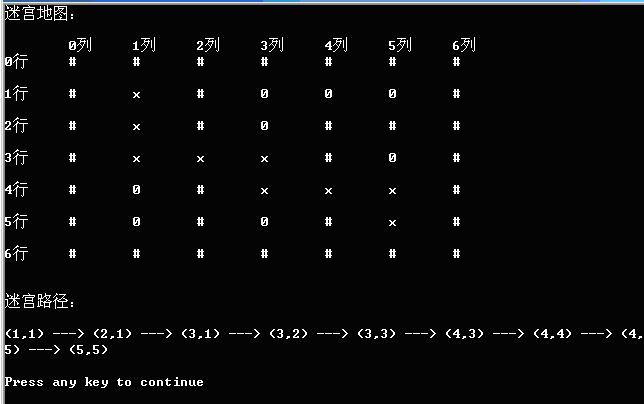

# 数据结构课程设计题目

## 1 考试报名系统 (**必做**)

### 1.1 题目简介

考试报名工作给各高校报名工作带来了新的挑战，给教务管理部门增加了很大的工作量。本项目是对考试报名管理的简单模拟，用控制台选项的选择方式完成下列功能：输入考生信息；输出考生信息；查询考生信息；添加考生信息；修改考生信息；删除考生信息

### 1.2 题目功能要求

本题的实质是完成对考生信息的建立，查找，插入，修改，删除等功能。其中考生信息包括准考证号，姓名，性别，年龄和报考类别等信息。项目在设计时应首先确定系统的数据结构，定义类的成员变量和成员函数；然后实现各成员函数以完成对数据操作的相应功能；最后完成主函数以验证各个成员函数的功能并得到运行结果。（建议采用链表实现）

### 1.3 系统示例

 

### 1.4 解答

[考试报名系统](1.考试报名系统/1_考试报名系统.md)

## 2 两个有序链表序列的交集

### 2.1 题目简介

已知两个非降序链表序列S1和S2，设计函数构造出S1和S2的交集新链表S3

### 2.2 题目能要求(要求采用链表)

1. 输入说明：输入分2行，分别在每行给出由若干个正整数构成的非降序序列，用-1表示序列的结尾（-1不属于这个序列）。数字用空格间隔

2. 输出说明：在一行中输出两个输入序列的交集序列，数字间用空格分开，结尾不能有多余空格；若新链表为空，输出NULL

3. 测试用例：

   | 序号 | 输入                     | 输出      | 说明                           |
   | ---- | ------------------------ | --------- | ------------------------------ |
   | 1    | 1 2 5 -12 4 5 8 10 -1    | 2 5       | 一般情况                       |
   | 2    | 1 3 5 -12 4 6 8 10 -1    | NULL      | 交集为空的情况                 |
   | 3    | 1 2 3 4 5 -11 2 3 4 5 -1 | 1 2 3 4 5 | 完全相交的情况                 |
   | 4    | 3 5 7 -12 3 4 5 6 7 8 -1 | 3 5 7     | 其中一个序列完全属于交集的情况 |
   | 5    | -110 100 1000 -1         | NULL      | 其中一个序列为空的情况         |

### 2.3 解答

[两个有序链表序列的交集](2.两个有序链表序列的交集/2_两个有序链表序列的交集.md)

## 3 勇闯迷宫游戏

### 3.1 题目简介

迷宫只有两个门，一个门叫入口，另一个门叫出口。一个骑士骑马从入口进入迷宫，迷宫设置很多障碍，骑士需要在迷宫中寻找通路以到达出口。

### 3.2 题目要求

迷宫问题的求解过程可以采用回溯法即在一定的约束条件下试探地搜索前进，若前进中受阻，则及时回头纠正错误另择通路继续搜索的方法。从入口出发，按某一方向向前探索，若能走通，即某处可达，则到达新点，否则探索下一个方向；若所有的方向均没有通路，则沿原路返回前一点，换下一个方向再继续试探，直到所有可能的道路都探索到，或找到一条通路，或无路可走又返回入口点。在求解过程中，为了保证在达到某一个点后不能向前继续行走时，能正确返回前一个以便从下一个方向向前试探，则需要在试探过程中保存所能够达到的每个点的下标以及该点前进的方向，当找到出口时试探过程就结束了。

### 3.3 题目示例

### 3.4 解答

[勇闯迷宫游戏](3.勇闯迷宫游戏/3_勇闯迷宫游戏.md)

## 4 算数表达式求解

### 4.1 题目内容

​	从键盘上输入中缀算数表达式，包括括号，计算出表达式的值

### 4.2 题目要求

1. 程序对所有输入的表达式作简单的判断，如表达式有错，能给出适当的提示。支持包括加减，乘除取余，乘方和括号等操作符，其中优先级是等于<括号<加减<乘除取余<乘方

2. 能处理单目运算符：+或-

### 4.3 题目测试用例

输入表达式：

-2×（3+5）+2^3/4=

-14

是否继续（y，n）？y

输入表达式：

2^4/8-(+2+8)%3=

1

是否继续（y，n）？n

### 4.4 解答

[算术表达式求解](4.算术表达式求解/4_算术表达式求解.md)

## 5 银行业务

### 5.1 题目内容

设某银行有A，B两个业务窗口，且处理业务的速度不一样，其中A窗口处理速度是B窗口的2倍----即当A窗口每处理完2个顾客是，B窗口处理完1个顾客。给定到达银行的顾客序列，请按照业务完成的顺序输出顾客序列。假定不考虑顾客信后到达的时间间隔，并且当不同窗口同时处理完2个顾客时，A窗口的顾客优先输出。

### 5.2 题目功能要求

1 输入说明：输入为一行正整数，其中第一数字N（N<=1000）为顾客总数，后面跟着N位顾客的编号。编号为奇数的顾客需要到A窗口办理业务，为偶数的顾客则去B窗口。数字间以空格分隔。

2 输出说明：按照业务处理完成的顺序输出顾客的编号。数字键以空格分隔，但是最后一个编号不能有多余的空格。

### 5.3 测试用例

| 序号 | 输入                 | 输出               | 说明                |
| ---- | -------------------- | ------------------ | ------------------- |
| 1    | 8 2 1 3 9 4 11 13 15 | 1 3 2 9 11 4 13 15 | 正常测试，A窗口人多 |
| 2    | 8 2 1 3 9 4 11 12 16 | 1 3 2 9 11 4 12 16 | 正常测试，B窗口人多 |
| 3    | 1 6                  | 6                  | 最小N               |

### 5.4 解答

[银行业务](5.银行业务/5_银行业务.md)

## 6 家谱管理系统

### 6.1 题目简介

家谱是一种以表谱形式，记载一个以血缘关系为主体的家族世袭繁衍和重要任务事迹的特殊图书体裁。家谱是中国特有的文化遗产，是中华民族的三大文献（国史，地志，族谱）之一，属于珍贵的人文资料，对于历史学，民俗学，人口学，社会学和经济学的深入研究，均有其不可替代的独特功能。本项目兑对家谱管理进行简单的模拟，以实现查看祖先和子孙个人信息，插入家族成员，删除家族成员的功能 

### 6.2 题目功能要求

本项目的实质是完成兑家谱成员信息的建立，查找，插入，修改，删除等功能，可以首先定义家族成员数据结构，然后将每个功能作为一个成员函数来完成对数据的操作，最后完成主函数以验证各个函数功能并得到运行结果

### 6.3 题目示例

### 6.4 解答

[家谱管理系统](6.家谱管理系统/6_家谱管理系统.md)

## 7 修理牧场

### 7.1 题目简介

农夫要修理牧场的一段栅栏，他测量了栅栏，发现需要N块木头，每块木头长度为整数Li个长度单位，于是他购买了一个很长的，能锯成N块的木头，即该木头的长度是Li的总和

但是农夫自己没有锯子，请人锯木的酬金跟这段木头的长度成正比。为简单起见，不妨就设酬金等于所锯木头的长度。例如，要将长度为20的木头锯成长度为8，7和5的三段，第一次锯木头将木头锯成12和8，花费20；第二次锯木头将长度为12的木头锯成7和5花费12，总花费32元。如果第一次将木头锯成15和5，则第二次将木头锯成7和8，那么总的花费是35（大于32）

### 7.2 题目功能要求

1. 输入格式：输入第一行给出正整数N（N《104），表示要将木头锯成N块。第二行给出N个正整数，表示每块木头的长度

2. 输出格式：输出一个整数，即将木头锯成N块的最小花费 

### 7.3 题目示例

### 7.4 解答

[修理牧场](7.修理牧场/7_修理牧场)

## 8  电网建设造价模拟系统

### 8.1 题目简介

假设一个城市有n个小区，要实现n个小区之间的电网都能够相互接通，构造这个城市n个小区之间的电网，使总工程造价最低。请设计一个能够满足要求的造价方案

### 8.2 题目功能要求

在每个小区之间都可以设置一条电网线路，都要付出相应的经济代价。n个小区之间最多可以有n（n-1）/2条线路，选择其中的n-1条使总的耗费最少 

### 8.3 题目示例

### 8.4 解答

[电网建设造价模拟系统](8.电网建设造价模拟系统/8_电网建设造价模拟系统)

## 9  排课软件

### 9.1 题目内容

大学的每个专业都要进行排课。假设任何专业都有固定的学习年限，每学年含两学期，每个专业开设的课程都是确定的，而且课程在开设时间的安排必须满足先修关系。每门课程有哪些先修课程是确定的。每门课恰好占一个学期，假定每天上午与下午各有5节课。是在这样的前提下设计一个教学计划编制程序

### 9.2 题目功能要求

1. 输入数据包括：个学期所开的课程数（必须使每学期所开的课程数之和与课程总数相等），课程编号，课程名称，周学时数，指定开课学期，先决条件。如指定开课学期为0，表示有电脑自行指定开课学期。

2. 如输入数据不合理，比如每学期所开的课程数值和与课程总数不相等，应显示适当的提示信息

3. 用文本文件存储输入数据，并且读入计算机。

4. 用文本文件存储产生的各学期的课表

### 9.3 排课要求与课程信息

假设周一至周五上课，每天上10节课，第1大节为第1-2节课，第二大节为第3-5节课，第3大节为第6-7节课，第4大节为8-10节课，在排课时，如一门课程有3节课，则优先安排3节课连续上；如3节课连续无法按排，再优先安排两节课连续上，最后再安排单节课上的情况；如果一门课程需要安排上两天，为教学效果较好，最好不安排在相邻的两天，比如优先安排相隔2天上课，设weekday表示当前安排上课的工作日期，下一次排课的工作日是：

weekday=（weekday+2-5）？（weekday+2-5）：（weekday+2）；

课程信息见**9.排课软件/course.txt**

### 9.4 解答

[排课软件](9.排课软件/9_排课软件.md)

## 10 8种排序算法的比较案例 (必做)

### 10.1 题目简介

随机函数产生一百，一千，一万和十万个随机数，用快速排序，直接插入排序，冒泡排序，选择排序的排序方法排序，并统计每种排序所花费的排序时间和交换次数。其中，随机数的个数由用户定义，系统产生随机数。并且显示他们的比较次数。

请在文档中记录上述数据量下，各种排序的计算时间和存储开销，并且根据实验结果说明这些方法的优缺点。

### 10.2 题目示例

### 10.3 解答